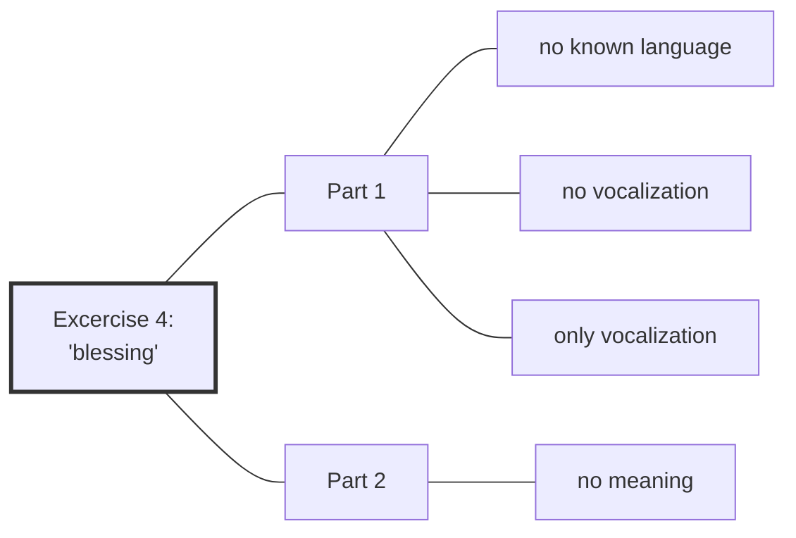

#TranscriptSummary

[[Preliminaries Regarding Voice, Movement, and Gesture - Part 2|Preliminaries Regarding Voice, Movement, and Gesture - Part 2 🡄]] | [[2020 Vajra Music|🡅]] | [[Preliminaries Regarding Voice, Movement, and Gesture - Part 4|🡆 Preliminaries Regarding Voice, Movement, and Gesture - Part 4]]

Series: [[2020 Vajra Music]]
Transcript: [[0303 Preliminaries Regarding Voice, Movement, and Gesture - Part 3]]
Transcript PDF: [[2020_0303 Preliminaries Regarding Voice, Movement, and Gesture - Part 3.pdf]]

![[20200303-Rob_Burbea-GAIA-preliminaries_regarding_voice_movement_and_gesture_part_3-62454.mp3]]



## Index
<span class="counts">_[[Daimon]] (80) · [[Soul]] (70) · [[Centre]] (53) · [[Image]] (43) · [[Skandhas]] (26) · [[Blessing]] (24) · [[Personhood]] (21) · [[Imaginal]] (16) · [[Energy Body]] (14) · [[Soulmaking]] (14) · [[Dukkha]] (10) · [[The Self]] (10) · [[Insight]] (9) · [[Divinity]] (8) · [[Dyad]] (8) · [[Fabrication]] (8) · [[Conceptual Framework]] (7) · [[Sabbath]] (7) · [[Death]] (6) · [[Emptiness]] (6) · [[Anatta]] (5) · [[Dharma]] (5) · [[Dimensionality]] (5) · [[Embodiment]] (5) · [[Buddha]] (4) · [[Desire]] (4) · [[Duty]] (4) · [[Emotions]] (4) · [[Experience]] (4) · [[Dependent Origination]] (3) · [[Dominant Culture]] (3) · [[Eternality]] (3) · [[Gratitude]] (3) · [[Metta]] (3) · [[Nondualism]] (3) · [[Perception]] (3) · [[Sensing the other as angel]] (3) · [[Ultimate Truth]] (3) · [[Unfathomability]] (3) · [[Via Negativa]] (3) · [[Ways of Looking]] (3) · [[Antinomy]] (2) · [[Buddhism]] (2) · [[Christianity]] (2) · [[Dakini]] (2) · [[Eros]] (2) · [[Four Noble Truths]] (2) · [[History]] (2) · [[Infinity]] (2) · [[Love]] (2) · [[Receptivity]] (2) · [[Retreat]] (2) · [[Attention]] · [[Awareness]] · [[Beauty]] · [[Ethics]] · [[Gestalt Psychology]] · [[Impermanence]] · [[In Psyche's Orchard]] · [[Judaism]] · [[Logos]] · [[Meaningfulness]] · [[Meditation]] · [[Middle Way]] · [[Passion]] · [[Phenomenology]] · [[Relationships]] · [[Sila and Soul]] · [[Soulmaking Dynamic]] · [[Temenos]] · [[The Image of Ethics]] · [[Vajrayana]]_</span>
<br/>

## Referenced talks
- [[Practising with Death and Dying]]
- [[Pain, as Void and as Sacrament]]
- [[Heat and the Material]]
- [[Sila and Soul]]
- [[The Image of Ethics]]

## Paragraphs
[[Preliminaries Regarding Voice, Movement, and Gesture - Part 3 -|plain list]]

### "Centring"
##### Fourth excercise with two parts, but first intro into terminology
<span class="counts">**[[0303 Preliminaries Regarding Voice, Movement, and Gesture - Part 3#^1-1|1-1]]**: _[[Soulmaking]] · [[Personhood]] (2)_</span>

---
##### A few weeks ago I felt "thrown off centre"
<span class="counts">**[[0303 Preliminaries Regarding Voice, Movement, and Gesture - Part 3#^1-2|1-2]]**: _[[Centre]] · [[Death]] (2)_</span>

---
##### "I've lost my centre", "I need to regain my centre"
<span class="counts">**[[0303 Preliminaries Regarding Voice, Movement, and Gesture - Part 3#^1-3|1-3]]**: _[[Centre]] (4)_</span>

---
##### Solution: reconnect with the angels
<span class="counts">**[[0303 Preliminaries Regarding Voice, Movement, and Gesture - Part 3#^1-4|1-4]]**: _[[Insight]] (4) · [[Daimon]] (5) · [[Image]]_</span>

```ad-tip
This relates to Aspect 5 below
```

---
##### I had gone into a much more one-dimensional mode of understanding
<span class="counts">**[[0303 Preliminaries Regarding Voice, Movement, and Gesture - Part 3#^2-1|2-1]]**: _[[Daimon]] (3) · [[Insight]]_</span>

---
##### Whats the logos of "centring"?
<span class="counts">**[[0303 Preliminaries Regarding Voice, Movement, and Gesture - Part 3#^2-2|2-2]]**: _[[Centre]] (6) · [[Personhood]] (2) · [[The Self]] · [[Logos]] · [[Conceptual Framework]]_</span>

- Aspect 1: interiority
- Aspect 2: circumscription
- Aspect 3: singularity
- Aspect 4: stillness
- Aspect 5: [[Divinity|theophany]]

---
##### Often the centre is conceived something within, an interiority (Aspect 1)
<span class="counts">**[[0303 Preliminaries Regarding Voice, Movement, and Gesture - Part 3#^2-3|2-3]]**: _[[Centre]] (8) · [[Embodiment]] · [[Conceptual Framework]] · [[Personhood]]_</span>

---
##### Centre also relates to the centre of a circumscribed area (Aspect 2)
<span class="counts">**[[0303 Preliminaries Regarding Voice, Movement, and Gesture - Part 3#^2-4|2-4]]**: _[[Personhood]] · [[The Self]] · [[Centre]] (6)_</span>

---
##### Rather than "this area is me" we have a sense of the larger human being (image and analogue) 🟢 
<span class="counts">**[[0303 Preliminaries Regarding Voice, Movement, and Gesture - Part 3#^2-5|2-5]]**: _[[Centre]] · [[Daimon]] (6) · [[Personhood]] (2) · [[Death]] · [[In Psyche's Orchard]] · [[Image]] (3)_</span>

references [[Practising with Death and Dying]]

---
##### Where do I end?
<span class="counts">**[[0303 Preliminaries Regarding Voice, Movement, and Gesture - Part 3#^3-1|3-1]]**: _[[Gestalt Psychology]] · [[Image]] (5) · [[Imaginal]] · [[Daimon]] · [[Unfathomability]]_</span>

---
##### Singularity of self (Aspect 3)
<span class="counts">**[[0303 Preliminaries Regarding Voice, Movement, and Gesture - Part 3#^3-2|3-2]]**: _[[Personhood]] · [[Centre]] (7) · [[The Self]]_</span>

![[20200303-Rob_Burbea-GAIA-preliminaries_regarding_voice_movement_and_gesture_part_3-62454.mp3#t=11:42]]

---
##### You can reach out horizontally (socially) but also more plurally
<span class="counts">**[[0303 Preliminaries Regarding Voice, Movement, and Gesture - Part 3#^3-3|3-3]]**: _[[The Self]] (2) · [[Personhood]] · [[Death]] · [[Phenomenology]] · [[Experience]] · [[Anatta]] · [[Image]] (2) · [[Daimon]] (2)_</span>

---
##### The sense and sensing of being larger, having angelic dimensions
<span class="counts">**[[0303 Preliminaries Regarding Voice, Movement, and Gesture - Part 3#^3-4|3-4]]**: _[[Centre]] · [[Personhood]] (3) · [[Perception]] · [[Image]] · [[Dimensionality]] · [[Duty]]_</span>

```ad-quote
 And I find more and more these days, when things are difficult, when there's challenge different ways, that the sense (and I mean that word in its double meaning: the sense, the actual [[perception]], and the idea) of my human being or another human being is more along the lines of this [[Image|image and analogue]], of having [[Dimensionality|angelic dimensions]] which are refracted into the human life more or less at different times, with a [[duty]] to that. 
```

---
##### Finding in one's core the self, or stillness (Aspect 4)
<span class="counts">**[[0303 Preliminaries Regarding Voice, Movement, and Gesture - Part 3#^3-5|3-5]]**: _[[Centre]] (10) · [[Dharma]] (3) · [[The Self]]_</span>
```ad-danger
title: Interesting
Think about this "Dharma 101" view of not being able to find a self anywhere (and therefore certainly not in the centre).
```

```ad-quote
One could think about centring as, "I need to centre because I need to encounter that self at my centre." Or it could be that what I'm expecting at the centre is a kind of infinite depth of still nothingness, of stillness and nothingness - which is a wonderful sense: one can look inside, and there are different kinds of nothingness, different kinds of stillness. 
```

---
##### Looking deep inside myself, I encounter nothing
<span class="counts">**[[0303 Preliminaries Regarding Voice, Movement, and Gesture - Part 3#^4-1|4-1]]**: _[[Christianity]] (2) · [[Centre]] (2) · [[Image]] · [[Emptiness]] · [[Via Negativa]] (3)_</span>

---
##### If we do not aim for Aspect 4 we might see the face of the divine (Aspect 5)
<span class="counts">**[[0303 Preliminaries Regarding Voice, Movement, and Gesture - Part 3#^4-2|4-2]]**: _[[Centre]] (4) · [[Experience]] · [[Daimon]] (4) · [[Image]] · [[Divinity]] (4) · [[Emptiness]] (3)_</span>
```ad-quote
This angel, in the mystery of their being, in the mystery of this angelic constellation, this angelic relationship, this angel is both other and self. But it's [[Divinity|theophany]]. It's a face of the divine. It's an expression of the divine, which is different than an [[emptiness]]. An emptiness is not a theophany. An emptiness is usually construed as an essence, usually construed as a transcendent essence beyond all attributes. A theophany is a face, ... a being in itself... 
```
---

##### Not "at the centre", but "in relationship with a theophany"
<span class="counts">**[[0303 Preliminaries Regarding Voice, Movement, and Gesture - Part 3#^4-3|4-3]]**: _[[Centre]] (3) · [[Divinity]] · [[Soulmaking]] · [[Soul]] (3)_</span>

![[20200303-Rob_Burbea-GAIA-preliminaries_regarding_voice_movement_and_gesture_part_3-62454.mp3#t=20:04]]

---

### "Angel"
##### More on the word "angel" 🟢 
<span class="counts">**[[0303 Preliminaries Regarding Voice, Movement, and Gesture - Part 3#^4-4|4-4]]**: _[[Daimon]] (4) · [[Image]] · [[Soulmaking]] (3) · [[Energy Body]] · [[Attention]] · [[Receptivity]] · [[Judaism]] · [[Sabbath]] (4) · [[Personhood]]_</span>

references [[Pain, as Void and as Sacrament]]

---
##### One becomes a space of hospitality of the angels
<span class="counts">**[[0303 Preliminaries Regarding Voice, Movement, and Gesture - Part 3#^5-1|5-1]]**: _[[Soulmaking]] · [[Daimon]] (4) · [[Imaginal]]_</span>

---
##### Me, my project, the angel
<span class="counts">**[[0303 Preliminaries Regarding Voice, Movement, and Gesture - Part 3#^5-2|5-2]]**: _[[Daimon]] (2) · [[Imaginal]] · [[Desire]] (2) · [[Eros]]_</span>

---
##### We have to delimit
<span class="counts">**[[0303 Preliminaries Regarding Voice, Movement, and Gesture - Part 3#^5-3|5-3]]**: _[[Daimon]] (3)_</span>
```ad-quote
We have to delimit; we're not just open for any old ideas about angels and all that business. That's why I said the words, the concepts, are pointing us in a direction, and pointing us along a road, but that road is infinite. It has boundaries. It's not like _anything_ can fall under the scope of that road...
```

---
##### The terrain around the road develops as you walk down that road
<span class="counts">**[[0303 Preliminaries Regarding Voice, Movement, and Gesture - Part 3#^5-4|5-4]]**: _[[Daimon]] · [[Dependent Origination]] · [[Soulmaking]] (2) · [[Sabbath]] (3) · [[Eros]] · [[Soul]] (2) · [[Love]] · [[Imaginal]]_</span>

---
##### The angel may visit in reponse to the task that I'm given
<span class="counts">**[[0303 Preliminaries Regarding Voice, Movement, and Gesture - Part 3#^5-5|5-5]]**: _[[Dependent Origination]] (2) · [[Daimon]] (3) · [[Imaginal]]_</span>

---
##### Some people ask: "Why don't the angels seem to come to me?"
<span class="counts">**[[0303 Preliminaries Regarding Voice, Movement, and Gesture - Part 3#^5-6|5-6]]**: _[[Image]] (3) · [[Daimon]] (5) · [[Imaginal]] · [[Duty]]_</span>

---
##### There are lots of reasons
<span class="counts">**[[0303 Preliminaries Regarding Voice, Movement, and Gesture - Part 3#^6-1|6-1]]**: _[[Perception]] · [[Image]] (3) · [[Soul]] · [[Relationships]] · [[Emotions]] · [[Energy Body]] · [[Daimon]] · [[Desire]]_</span>

---
##### Images would arise, if you really deeply wanted them
<span class="counts">**[[0303 Preliminaries Regarding Voice, Movement, and Gesture - Part 3#^6-2|6-2]]**: _[[Image]] (5) · [[Emotions]] · [[Desire]]_</span>

---
##### Or they don't need you and you don't need them
<span class="counts">**[[0303 Preliminaries Regarding Voice, Movement, and Gesture - Part 3#^6-3|6-3]]**: _[[Daimon]] (4) · [[Imaginal]] (2) · [[Soul]]_</span>

```ad-quote
They don't need you and you don't need them, because there's nothing in the way a person is living and the choices that a person is making that needs the help or presence of the angels, of the imaginal figures. There's nothing really on the line, so to speak. There isn't really a [[Soul|soul-stretch]].
```

---
##### Daimons won't choose someone who is not willing to stretch 🟢 
<span class="counts">**[[0303 Preliminaries Regarding Voice, Movement, and Gesture - Part 3#^6-4|6-4]]**: _[[Soul]] (4) · [[Daimon]] (2) · [[Imaginal]]_</span>

references [[Heat and the Material]]

```ad-quote
They're not living and choosing in their life in ways that really stretch their [[soul]] or that open them to kind of soul-risks, if we might use that phrase. There's nothing really on the line. And they might be stretched in all kinds of ways - might be very busy, might be stretched doing something very helpful in the world, whatever, but it's not actually a soul-stretch, and there's no real risk there. And maybe it's that the [[Daimon|angels]], the [[Imaginal|imaginal figures]], the daimons, don't need and won't choose someone who is not willing to stretch - stretch themselves, stretch their lives, stretch their soul.
```

---
##### Maybe it needs a kind of antinomy to call forth the angels 🟢 
<span class="counts">**[[0303 Preliminaries Regarding Voice, Movement, and Gesture - Part 3#^6-5|6-5]]**: _[[Daimon]] (2) · [[Antinomy]] (2) · [[Ethics]] · [[Sila and Soul]] · [[The Image of Ethics]] · [[Soul]] (2) · [[Love]] · [[Duty]] (2)_</span>

![[20200303-Rob_Burbea-GAIA-preliminaries_regarding_voice_movement_and_gesture_part_3-62454.mp3#t=34:45]]

---
##### If it doesn't bother you, ok
<span class="counts">**[[0303 Preliminaries Regarding Voice, Movement, and Gesture - Part 3#^7-1|7-1]]**: _[[Daimon]] · [[Image]]_</span>

---


### "Soul"
##### A teacher said: "I don't really relate to the word 'soul'"
<span class="counts">**[[0303 Preliminaries Regarding Voice, Movement, and Gesture - Part 3#^7-2|7-2]]**: _[[Soulmaking]] (2) · [[Soul]] (4) · [[Dharma]] · [[Ways of Looking]] · [[Fabrication]] (2) · [[Insight]]_</span>

![[20200303-Rob_Burbea-GAIA-preliminaries_regarding_voice_movement_and_gesture_part_3-62454.mp3#t=37:22]]

```ad-quote
Oftentimes it's the 'making' that people don't relate to, the word 'making.' Of course, if you understand the whole track of exploration of [[ways of looking]] and [[fabrication]] ('fabrication' is just another word for 'making'), and how that deepens, and how it opens out, and the understanding it opens out, then the word 'making' is almost an indispensable word in 'soulmaking.' But for a lot of people, it's very puzzling, because you'd usually think of the word 'soul,' or have a sense of soul, or use that in a very reified way: it wouldn't be something that we _make_. It would be something that _is_, or we discover, or that just is a level of being or whatever.
```

---
##### "Well, do you really relate to the word 'aggregate'"
<span class="counts">**[[0303 Preliminaries Regarding Voice, Movement, and Gesture - Part 3#^7-3|7-3]]**: _[[Soul]] · [[Buddhism]] · [[Skandhas]] (4) · [[Emptiness]] (2) · [[Anatta]] (2) · [[Dharma]] · [[Insight]]_</span>

---
##### We are trained in certain words
<span class="counts">**[[0303 Preliminaries Regarding Voice, Movement, and Gesture - Part 3#^7-4|7-4]]**: _[[Skandhas]] (5) · [[Ways of Looking]] · [[Ultimate Truth]] · [[Personhood]] · [[Buddhism]]_</span>

---
##### Couldn't 'soul' be similarly unfamiliar at first, but eventually become helpful like 'aggregate'?
<span class="counts">**[[0303 Preliminaries Regarding Voice, Movement, and Gesture - Part 3#^8-1|8-1]]**: _[[Soul]] (3) · [[Insight]] · [[Skandhas]] (5) · [[Dukkha]] (2) · [[Ultimate Truth]] (2)_</span>

---
##### The dukkha of soullessness
<span class="counts">**[[0303 Preliminaries Regarding Voice, Movement, and Gesture - Part 3#^8-2|8-2]]**: _[[Soul]] (4) · [[Insight]] · [[Dukkha]] (5) · [[Skandhas]] · [[Four Noble Truths]] (2) · [[Dominant Culture]] · [[Beauty]] · [[Dimensionality]]_</span>

---
##### Words from other conceptual frameworks might turn out to be useful, like words from psychology
<span class="counts">**[[0303 Preliminaries Regarding Voice, Movement, and Gesture - Part 3#^8-3|8-3]]**: _[[Skandhas]] (2) · [[Dukkha]] · [[Soul]] (2) · [[Dominant Culture]] · [[Conceptual Framework]] (5) · [[History]]_</span>

---
##### Or words like 'brain'
<span class="counts">**[[0303 Preliminaries Regarding Voice, Movement, and Gesture - Part 3#^8-4|8-4]]**: _[[Buddha]] (2) · [[Dominant Culture]]_</span>

---
##### Like 'aggregates', 'soul' can be a word I can relate to skillfully over time
<span class="counts">**[[0303 Preliminaries Regarding Voice, Movement, and Gesture - Part 3#^9-1|9-1]]**: _[[History]] · [[Soul]] · [[Skandhas]] · [[Ways of Looking]] · [[Anatta]] (2) · [[Fabrication]] (4) · [[Dukkha]]_</span>

---
##### But: the notion of the aggregates and the notion of soul are divergent directions when making sense of a person
<span class="counts">**[[0303 Preliminaries Regarding Voice, Movement, and Gesture - Part 3#^9-2|9-2]]**: _[[Fabrication]] (2) · [[Dukkha]] · [[Skandhas]] (3) · [[Personhood]] (5) · [[Death]] · [[Soul]]_</span>

---
##### Even Vajrayana (with seeing the aggregates as holy) misses the person
<span class="counts">**[[0303 Preliminaries Regarding Voice, Movement, and Gesture - Part 3#^9-3|9-3]]**: _[[Vajrayana]] · [[Skandhas]] (5) · [[Personhood]] · [[Divinity]] · [[Buddha]] (2) · [[Dakini]] (2) · [[Soul]]_</span>

---


### The unlimited range of those words
##### All this emerges naturally through the process of sensing with soul
<span class="counts">**[[0303 Preliminaries Regarding Voice, Movement, and Gesture - Part 3#^9-4|9-4]]**: _[[Soul]] (2) · [[Daimon]] · [[Soulmaking]] · [[Dimensionality]] · [[Dyad]] (2)_</span>

---
##### Sensing the other as angel
<span class="counts">**[[0303 Preliminaries Regarding Voice, Movement, and Gesture - Part 3#^9-5|9-5]]**: _[[Retreat]] · [[Soul]] (5) · [[Sensing the other as angel]] (3) · [[Daimon]] (3) · [[Passion]] · [[Image]]_</span>

---
##### Words like 'angel', 'soul', 'image' imply unfathomability
<span class="counts">**[[0303 Preliminaries Regarding Voice, Movement, and Gesture - Part 3#^10-1|10-1]]**: _[[Daimon]] (9) · [[Soul]] (6) · [[Image]] (3) · [[Unfathomability]] (2) · [[Nondualism]] (3) · [[Dimensionality]] · [[Divinity]] · [[Infinity]] (2) · [[Imaginal]] · [[Middle Way]]_</span>

![[20200303-Rob_Burbea-GAIA-preliminaries_regarding_voice_movement_and_gesture_part_3-62454.mp3#t=53:43]]

```ad-quote
There's a mystery in the kind of impossibility of finally dividing them up as one or two, this being that I'm encountering, this being that I'm sensing with soul. ... So that infinite echoing and mirroring is of the angel into this person's life, and this person's life and this person's being as the infinite echoing and mirroring of the angel, and the angel also a mirror and an echo of the being, in a kind of two-way, back-and-forth echoing and mirroring each other.
```

---
##### Angel is not of space or time
<span class="counts">**[[0303 Preliminaries Regarding Voice, Movement, and Gesture - Part 3#^10-2|10-2]]**: _[[Daimon]] (11) · [[Soul]] (2) · [[Image]] (2) · [[Eternality]] (2) · [[Death]]_</span>

```ad-quote
The being of the angel, the dimension of the being of the angel, is not of space. It's not located inside me, or next to me, or behind me, or wherever, above me, below me, but nor is it located in time. It's refracted ... into space and time. And there's a sense, too, of participation ... or reconnecting with my sense of participating in something, and the mystery of that word.
```

---
##### Those words have soft and elastic edges, they will stretch
<span class="counts">**[[0303 Preliminaries Regarding Voice, Movement, and Gesture - Part 3#^10-3|10-3]]**: _[[Soul]] (4) · [[Daimon]] (3) · [[Image]] · [[Perception]] · [[Divinity]] · [[Eternality]] · [[Soulmaking]] · [[Soulmaking Dynamic]]_</span>

---

### Excercise 4: blessing
##### 2 dyad excercises
<span class="counts">**[[0303 Preliminaries Regarding Voice, Movement, and Gesture - Part 3#^11-1|11-1]]**: _[[Dyad]] (2)_</span>

---
##### Excercise 4.1: One person blesses, the other person receives the blessing
<span class="counts">**[[0303 Preliminaries Regarding Voice, Movement, and Gesture - Part 3#^11-3|11-3]]**: _[[Dyad]] (2) · [[Temenos]] · [[Blessing]] (2)_</span>

![[20200303-Rob_Burbea-GAIA-preliminaries_regarding_voice_movement_and_gesture_part_3-62454.mp3#t=59:49]]

---
##### 🟡 Excercise 4.1.1. no known language for blessing
<span class="counts">**[[0303 Preliminaries Regarding Voice, Movement, and Gesture - Part 3#^11-4|11-4]]**: _[[Embodiment]] · [[Blessing]] (5)_</span>

---
##### It can start with metta, praise, doxology, gratitude
<span class="counts">**[[0303 Preliminaries Regarding Voice, Movement, and Gesture - Part 3#^11-5|11-5]]**: _[[Soul]] · [[Blessing]] (3) · [[Metta]] (3) · [[Gratitude]] (3)_</span>

---
##### The notion grows what it means to bless and to be blessed - all becomes image
<span class="counts">**[[0303 Preliminaries Regarding Voice, Movement, and Gesture - Part 3#^11-6|11-6]]**: _[[Soulmaking]] · [[Soul]] · [[Experience]] · [[The Self]] (2) · [[Image]] (3) · [[Imaginal]] (2) · [[Blessing]]_</span>

---
##### The blessed one is not responding but is sensitive with the energy body
<span class="counts">**[[0303 Preliminaries Regarding Voice, Movement, and Gesture - Part 3#^12-1|12-1]]**: _[[Dyad]] · [[Receptivity]] · [[Energy Body]] (5) · [[Blessing]] · [[Emotions]] · [[Soul]] · [[Impermanence]]_</span>

---
##### Include sensing with soul the whole relational field
<span class="counts">**[[0303 Preliminaries Regarding Voice, Movement, and Gesture - Part 3#^12-2|12-2]]**: _[[Energy Body]] (4) · [[Blessing]] · [[Emotions]] · [[Awareness]] · [[Soul]] (3) · [[Experience]] · [[The Self]]_</span>

---
##### Change after (probably max) 10 minutes, depending on how awkward it is
<span class="counts">**[[0303 Preliminaries Regarding Voice, Movement, and Gesture - Part 3#^12-3|12-3]]**: _[[Meditation]]_</span>

---
##### Blessing ==variations==
<span class="counts">**[[0303 Preliminaries Regarding Voice, Movement, and Gesture - Part 3#^12-4|12-4]]**: _[[Blessing]] · [[Soul]] · [[Soulmaking]] · [[Imaginal]]_</span>
- fast or slow
- pauses between utterances or continuous stream.
- loud or soft
=> let the sense of soulfulness guide you

---
##### Feel resonances in the soul and the energy body, maybe bring in deliberate imaginal sense
<span class="counts">**[[0303 Preliminaries Regarding Voice, Movement, and Gesture - Part 3#^12-5|12-5]]**: _[[Energy Body]] (3) · [[Soul]] (2) · [[Blessing]] (2) · [[Image]] (5) · [[Imaginal]] (2)_</span>

---
##### 🟡 Excercise 4.1.2: no vocalizations
<span class="counts">**[[0303 Preliminaries Regarding Voice, Movement, and Gesture - Part 3#^13-1|13-1]]**: _[[Embodiment]] · [[Soul]]_</span>

![[20200303-Rob_Burbea-GAIA-preliminaries_regarding_voice_movement_and_gesture_part_3-62454.mp3#t=1:12:19]]
==variations==
- no words, no language (4.1.1)
- gestures/movements, not only no words but no vocalizations whatsoever (4.1.2)
- no gestures/movements, only vocalizations (4.1.3)

---
##### 🟡 Excercise 4.1.3: only vocalizations
<span class="counts">[[0303 Preliminaries Regarding Voice, Movement, and Gesture - Part 3#^13-2|13-2]]</span>

---
##### Treat singing as "not vocalizing", but then also try not singing
<span class="counts">**[[0303 Preliminaries Regarding Voice, Movement, and Gesture - Part 3#^13-3|13-3]]**: _[[Blessing]] (2)_</span>
==variations==
- singing (instead of vocalizing)
- humming

---
##### 🟡 Excercise 4.2 (2nd part)
<span class="counts">[[0303 Preliminaries Regarding Voice, Movement, and Gesture - Part 3#^13-4|13-4]]</span>

##### Drop any idea of an attempt to express some meaning
<span class="counts">**[[0303 Preliminaries Regarding Voice, Movement, and Gesture - Part 3#^13-6|13-6]]**: _[[Blessing]] · [[Image]] · [[Embodiment]]_</span>

![[20200303-Rob_Burbea-GAIA-preliminaries_regarding_voice_movement_and_gesture_part_3-62454.mp3#t=1:14:32]]

```ad-quote
You're taking it to another level, really, dropping any idea of an attempt to express or convey any meaning, something that _could_ get put into words, or an emotion. You're not conveying or expressing an emotion, or an [[image]], or an event, or a story, or my story, or your story, or whatever it is. There's just [[Embodiment|movement, gesture, and voice]]. And dropping any sense of an attempt to express something with that, to convey something that _means_ anything with that.
```

---
##### Soul is more than any meaning
<span class="counts">**[[0303 Preliminaries Regarding Voice, Movement, and Gesture - Part 3#^13-7|13-7]]**: _[[Imaginal]] · [[Meaningfulness]] · [[Soul]] (4) · [[Blessing]]_</span>

---
##### "Blessing" is already at the edge of meaning, and Part 2 goes beyond even that
<span class="counts">**[[0303 Preliminaries Regarding Voice, Movement, and Gesture - Part 3#^13-8|13-8]]**: _[[Blessing]] (3)_</span>

---

### Outro
##### It might feel awkward, but it can grow and deepen
<span class="counts">**[[0303 Preliminaries Regarding Voice, Movement, and Gesture - Part 3#^14-2|14-2]]**: _[[The Self]] · [[Retreat]]_</span>

![[20200303-Rob_Burbea-GAIA-preliminaries_regarding_voice_movement_and_gesture_part_3-62454.mp3#t=1:18:31]]

---
##### Recognising soul is the main point
<span class="counts">**[[0303 Preliminaries Regarding Voice, Movement, and Gesture - Part 3#^14-3|14-3]]**: _[[Blessing]] · [[Dyad]] · [[Embodiment]] · [[Soul]] (7) · [[Dimensionality]]_</span>
