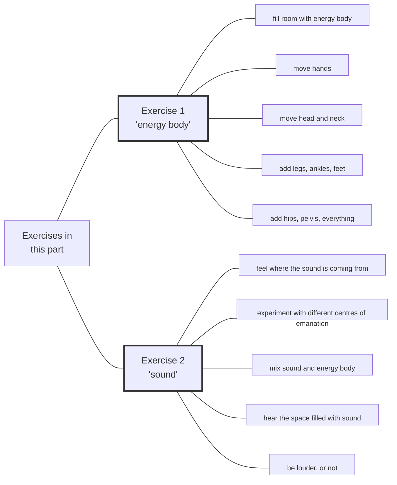

#Talk

 | [[2020 Vajra Music|🡅]] | [[Preliminaries Regarding Voice, Movement, and Gesture - Part 2|🡆 Preliminaries Regarding Voice, Movement, and Gesture - Part 2]]

Series: [[2020 Vajra Music]]
Transcript: [[0301 Preliminaries Regarding Voice, Movement, and Gesture - Part 1]]
Transcript PDF: [[2020_0301 Preliminaries Regarding Voice, Movement, and Gesture - Part 1.pdf]]

![[20200301-Rob_Burbea-GAIA-preliminaries_regarding_voice_movement_and_gesture_part_1-62452.mp3]]

admonitions for structured listening are ==marked==



## Index
<span class="counts">_[[Energy body]] (51) · [[Embodiment]] (30) · [[Meditation]] (24) · [[Soulmaking]] (23) · [[Music]] (21) · [[Soul]] (21) · [[Inertia]] (18) · [[Desire]] (17) · [[Fantasy]] (17) · [[Awareness]] (15) · [[Dharma]] (14) · [[Dukkha]] (14) · [[Love]] (14) · [[Image]] (13) · [[Jhanas]] (12) · [[Preliminaries]] (12) · [[Centre]] (11) · [[Conceptual framework]] (11) · [[Retreat]] (11) · [[Elitism]] (10) · [[Freedom]] (9) · [[Music#Jazz]] (9) · [[Soulmaking dynamic]] (8) · [[Energy]] (7) · [[Experience]] (7) · [[Awakening]] (6) · [[Grief]] (6) · [[Beauty]] (5) · [[Passion]] (5) · [[Steadiness]] (5) · [[Active listening]] (4) · [[Four Noble Truths]] (4) · [[History]] (4) · [[Imaginal]] (4) · [[Scientific research]] (4) · [[Emptiness]] (3) · [[Eros]] (3) · [[Conventional reality]] (2) · [[Devotion]] (2) · [[Hearing All Sounds as Mantra]] (2) · [[Mind]] (2) · [[Mindfulness]] (2) · [[Nondualism]] (2) · [[Personhood]] (2) · [[Seeing That Frees]] (2) · [[The Movement of Devotion]] (2) · [[Albert Einstein]] · [[Anatta]] · [[Anthropology]] · [[Blessing]] · [[Breath]] · [[Buddha]] · [[Compassion]] · [[Consciousness]] · [[Death]] · [[Dimensionality]] · [[Engagement and Activism]] · [[Equanimity]] · [[Gaia House]] · [[Infinity]] · [[Insight]] · [[Ludwig van Beethoven]] · [[Mahayana]] · [[Metta]] · [[Practicing the Jhanas (retreat)]] · [[Rebirth]] · [[Relationships]] · [[Sangha]] · [[Satipatthana Sutta]] · [[Spirituality]] · [[Theravada]] · [[Tibetan Buddhism]] · [[Voice, Movement, and the Possibilities of Soul]]_</span>
<br/>

## Referenced talks
[[Voice, Movement, and the Possibilities of Soul]]
[[The Movement of Devotion]]
[[Hearing All Sounds as Mantra]]
[[Engagement and Activism]]
[[Orienting to This Jhana Retreat]]


## Paragraphs
[[Preliminaries Regarding Voice, Movement, and Gesture - Part 1 -|plain list]]

### Intro

---
##### Time is short, thus these talks
<span class="counts">[[0301 Preliminaries Regarding Voice, Movement, and Gesture - Part 1#^1-1|1-1]]</span>

---
##### "Études", Preliminaries"
<span class="counts">**[[0301 Preliminaries Regarding Voice, Movement, and Gesture - Part 1#^1-2|1-2]]**: _[[Preliminaries]] (4) · [[Tibetan Buddhism]] · [[Soulmaking]]_</span>

---
##### It's going to be about movement, gesture, and voice
<span class="counts">**[[0301 Preliminaries Regarding Voice, Movement, and Gesture - Part 1#^1-3|1-3]]**: _[[Preliminaries]] · [[Embodiment]] (2) · [[Experience]] · [[Soul]] · [[Personhood]] (2) · [[Anthropology]]_</span>
 
---
##### This is a beginning which should be developed
<span class="counts">**[[0301 Preliminaries Regarding Voice, Movement, and Gesture - Part 1#^1-4|1-4]]**: _[[Preliminaries]] · [[Embodiment]] · [[History]] · [[Soulmaking]] · [[Soulmaking dynamic]]_</span>

---
##### Earlier talks 🟢 
<span class="counts">**[[0301 Preliminaries Regarding Voice, Movement, and Gesture - Part 1#^1-5|1-5]]**: _[[Embodiment]] · [[Meditation]] (2) · [[Voice, Movement, and the Possibilities of Soul]] · [[The Movement of Devotion]]_</span>

---
##### Instructions then were difficult to absorb 🟢 
<span class="counts">**[[0301 Preliminaries Regarding Voice, Movement, and Gesture - Part 1#^2-1|2-1]]**: _[[Soulmaking]] · [[The Movement of Devotion]] · [[Meditation]] (2) · [[Hearing All Sounds as Mantra]]_</span>

---
##### A lot was going on then
<span class="counts">[[0301 Preliminaries Regarding Voice, Movement, and Gesture - Part 1#^2-2|2-2]]</span>

---
##### I'm always in a rush! 😀 
<span class="counts">**[[0301 Preliminaries Regarding Voice, Movement, and Gesture - Part 1#^2-3|2-3]]**: _[[Engagement and Activism]] · [[Energy body]] (2) · [[Devotion]] (2) · [[Meditation]] (2) · [[Breath]] · [[Jhanas]] (2) · [[Practicing the Jhanas (retreat)]] · [[Retreat]] · [[Embodiment]]_</span>

```ad-quote
But again, how many people will actually take that out, and extract it, and capitalize on it, and repeat it, isolate it and repeat it as something, as a practice, as a set of instructions that are developable, remains to be seen.
```

---
##### ==Make a set of instructions==
<span class="counts">**[[0301 Preliminaries Regarding Voice, Movement, and Gesture - Part 1#^3-1|3-1]]**: _[[Sangha]]_</span>

![[20200301-Rob_Burbea-GAIA-preliminaries_regarding_voice_movement_and_gesture_part_1-62452.mp3#t=09:23]]

```ad-quote
One could, if one gets really interested in this stuff, go back to all those talks, and listen again, and listen to what's being said in the background, and those instructions that one might miss. Take the material out. Extract it. Write it down. Make a set of instructions. Start practising it. So there's an invitation there.
```

```ad-danger
title: Think about that
In which way is this relevant for the Custodians?
```

---
##### We need wings to fly in Soulmaking
<span class="counts">**[[0301 Preliminaries Regarding Voice, Movement, and Gesture - Part 1#^3-2|3-2]]**: _[[Embodiment]] · [[Preliminaries]] · [[Soulmaking]] (2)_</span>

---
##### What's required may not be obvious at all
<span class="counts">**[[0301 Preliminaries Regarding Voice, Movement, and Gesture - Part 1#^3-3|3-3]]**: _[[Freedom]]_</span>

```ad-tip
simile: Tiny bone in a bird
```

---
##### Not central, but indispensable
<span class="counts">**[[0301 Preliminaries Regarding Voice, Movement, and Gesture - Part 1#^3-4|3-4]]**: _[[Freedom]] (2) · [[Soulmaking]] (3)_</span>

---
##### Soulmaking Dynamic
<span class="counts">**[[0301 Preliminaries Regarding Voice, Movement, and Gesture - Part 1#^3-5|3-5]]**: _[[Soulmaking dynamic]] (5) · [[Soul]]_</span>

![[20200301-Rob_Burbea-GAIA-preliminaries_regarding_voice_movement_and_gesture_part_1-62452.mp3#t=13:09]]

---
##### Soulmaking wants to include movement, gesture, and voice
<span class="counts">**[[0301 Preliminaries Regarding Voice, Movement, and Gesture - Part 1#^4-1|4-1]]**: _[[Soulmaking dynamic]] (2) · [[Embodiment]] (3)_</span>

---
##### Note that I'm often going too fast
<span class="counts">**[[0301 Preliminaries Regarding Voice, Movement, and Gesture - Part 1#^4-2|4-2]]**: _[[Retreat]]_</span>

---
### Condensing
##### ==Is it possible to listen more actively?==
<span class="counts">[[0301 Preliminaries Regarding Voice, Movement, and Gesture - Part 1#^4-3|4-3]]</span>

![[20200301-Rob_Burbea-GAIA-preliminaries_regarding_voice_movement_and_gesture_part_1-62452.mp3#t=17:00]]

```ad-quote
But still, when you listen to this, this set of talks, when you listen to talks that have already been given - maybe by me; maybe by another teacher - is it possible to <i>think</i> about listening more actively?
```

---
##### ==Actively extract meditations, exercises, from what's being said==
<span class="counts">[[0301 Preliminaries Regarding Voice, Movement, and Gesture - Part 1#^4-4|4-4]]</span>

```ad-danger
title: Think about that
In which way is this relevant for the Custodians?
```

---
##### ==Actively extract larger principles==
<span class="counts">**[[0301 Preliminaries Regarding Voice, Movement, and Gesture - Part 1#^4-5|4-5]]**: _[[Conceptual framework]] · [[History]]_</span>

---
##### Example: the concept of "inertia"
<span class="counts">**[[0301 Preliminaries Regarding Voice, Movement, and Gesture - Part 1#^5-1|5-1]]**: _[[Meditation]] · [[Retreat]] (2) · [[Gaia House]] · [[Jhanas]] (2) · [[Inertia]] (5) · [[Dharma]] · [[Mind]]_</span>

```ad-warning
title: Interesting
see below, inertia is an important concept
```

---
##### Listening to talks together
<span class="counts">**[[0301 Preliminaries Regarding Voice, Movement, and Gesture - Part 1#^5-2|5-2]]**: _[[Meditation]] (2)_</span>

![[20200301-Rob_Burbea-GAIA-preliminaries_regarding_voice_movement_and_gesture_part_1-62452.mp3#t=21:14]]

```ad-tip
Could that be a routine agenda topic in the HAF yogis meetings?
```

---
##### Receptive listening tills the soil of the soul
<span class="counts">**[[0301 Preliminaries Regarding Voice, Movement, and Gesture - Part 1#^5-3|5-3]]**: _[[Active listening]] (3) · [[Soul]] (2) · [[Retreat]]_</span>

---
##### Seeing That Frees is often read too fast, without doing the practices
<span class="counts">**[[0301 Preliminaries Regarding Voice, Movement, and Gesture - Part 1#^5-4|5-4]]**: _[[Seeing That Frees]] · [[Mind]] · [[Inertia]] (5) · [[Active listening]]_</span>

---
##### Listening with blinders on
<span class="counts">**[[0301 Preliminaries Regarding Voice, Movement, and Gesture - Part 1#^6-1|6-1]]**: _[[Inertia]]_</span>

---
##### Listening is automatically sifting for significance
<span class="counts">**[[0301 Preliminaries Regarding Voice, Movement, and Gesture - Part 1#^6-2|6-2]]**: _[[Soul]] (2) · [[Consciousness]]_</span>

---
##### So be careful that topics might be not central but still are significant
<span class="counts">**[[0301 Preliminaries Regarding Voice, Movement, and Gesture - Part 1#^6-3|6-3]]**: _[[Soulmaking]] · [[Imaginal]] · [[Image]] (4)_</span>

---
##### Wisely assessing significance is hard
<span class="counts">**[[0301 Preliminaries Regarding Voice, Movement, and Gesture - Part 1#^6-4|6-4]]**: _[[Imaginal]] (2) · [[Image]] (3)_</span>

---
##### ==Structural listening==
<span class="counts">**[[0301 Preliminaries Regarding Voice, Movement, and Gesture - Part 1#^7-1|7-1]]**: _[[Dharma]] (2) · [[Seeing That Frees]] · [[Conceptual framework]] (7) · [[Insight]] · [[Soulmaking]] · [[Emptiness]] · [[Conventional reality]] (2)_</span>

```ad-quote
What would it be to listen or read _for_ and _from_ the whole conceptual framework? I'm listening _for_, or I'm reading _for_, to get a sense of, what is the whole conceptual framework. And then, when I think I have that, I'm listening _from_ the perspective of the whole conceptual framework. And that listening _from_ an understanding of the whole conceptual framework, holding it there, it frames my listening...
```

---
##### Because I understand where things are and how they work, I can find them a lot easier
<span class="counts">**[[0301 Preliminaries Regarding Voice, Movement, and Gesture - Part 1#^7-2|7-2]]**: _[[Conceptual framework]] (2)_</span>

---
##### Inquiry into inertia is important
<span class="counts">**[[0301 Preliminaries Regarding Voice, Movement, and Gesture - Part 1#^7-3|7-3]]**: _[[Inertia]] (6) · [[Meditation]] · [[Steadiness]]_</span>

---
##### Where's the inertia?
<span class="counts">**[[0301 Preliminaries Regarding Voice, Movement, and Gesture - Part 1#^7-3|7-3]]**: _[[Inertia]] (6) · [[Meditation]] · [[Steadiness]]_</span>

```ad-quote
Now, I would say that that inquiry into inertia, even though we're not really going into it at the moment [laughs] - again, I'm postponing it, or just mentioning it; I don't know if I'll ever get back to it - I would actually say that's _more_ important as a teaching, as an inquiry, structurally it's more important, at the meta-level it's more important than anything else that I might say in this set of talks about movement and gesture or anything else.
```

---
##### (Liberation of) sustained desire is needed to a goal
<span class="counts">**[[0301 Preliminaries Regarding Voice, Movement, and Gesture - Part 1#^8-1|8-1]]**: _[[Jhanas]] (4) · [[Retreat]] · [[Desire]] (7)_</span>

---
##### We can't help to move in the domain of my desires
<span class="counts">**[[0301 Preliminaries Regarding Voice, Movement, and Gesture - Part 1#^8-2|8-2]]**: _[[Jhanas]] (3) · [[Desire]] (2) · [[Meditation]] (2) · [[Freedom]] (2) · [[Inertia]]_</span>

![[20200301-Rob_Burbea-GAIA-preliminaries_regarding_voice_movement_and_gesture_part_1-62452.mp3#t=36:30]]

---
### "Why?
##### The "why" of these exercies is related to the "why" of practice in general
<span class="counts">[[0301 Preliminaries Regarding Voice, Movement, and Gesture - Part 1#^8-3|8-3]]</span>

---
##### The "why" (images and fantasies) will always have consequences
<span class="counts">**[[0301 Preliminaries Regarding Voice, Movement, and Gesture - Part 1#^8-4|8-4]]**: _[[Passion]] · [[Fantasy]] (8) · [[Dharma]] (3) · [[Awakening]] · [[Image]] (2) · [[Meditation]]_</span>

---
##### Do we want to unlimit them, if they're limited in an unhelpful way?
<span class="counts">**[[0301 Preliminaries Regarding Voice, Movement, and Gesture - Part 1#^9-1|9-1]]**: _[[Fantasy]] (3) · [[Awakening]]_</span>

---
##### "My husband doesn't need to meditate" (i.e. is already calm)
<span class="counts">**[[0301 Preliminaries Regarding Voice, Movement, and Gesture - Part 1#^9-2|9-2]]**: _[[Retreat]] (2)_</span>

---
##### That's a limited idea
<span class="counts">**[[0301 Preliminaries Regarding Voice, Movement, and Gesture - Part 1#^9-3|9-3]]**: _[[Steadiness]] (2) · [[Meditation]] (3) · [[Retreat]] (2)_</span>

---
##### It maybe would not be if it was a thoroughly investgated view
<span class="counts">**[[0301 Preliminaries Regarding Voice, Movement, and Gesture - Part 1#^9-4|9-4]]**: _[[Meditation]] (2) · [[Emptiness]] · [[Awareness]] · [[Freedom]] · [[Retreat]]_</span>

---
##### So "doesn't need to" might be a valid statement
<span class="counts">**[[0301 Preliminaries Regarding Voice, Movement, and Gesture - Part 1#^9-5|9-5]]**: _[[Metta]] · [[Compassion]] · [[Love]] · [[Equanimity]] · [[Mindfulness]] (2) · [[Experience]] (3)_</span>

![[20200301-Rob_Burbea-GAIA-preliminaries_regarding_voice_movement_and_gesture_part_1-62452.mp3#t=45:04]]

---
##### But imagine a musician who doesn't need to make music
<span class="counts">**[[0301 Preliminaries Regarding Voice, Movement, and Gesture - Part 1#^10-1|10-1]]**: _[[Music]] (2) · [[Fantasy]] (3) · [[Scientific research]] (3) · [[Love]] (5) · [[Soul]]_</span>

---
##### Inexhausibilities of those needs
<span class="counts">**[[0301 Preliminaries Regarding Voice, Movement, and Gesture - Part 1#^10-2|10-2]]**: _[[Beauty]] (2) · [[Love]] · [[Music]] (4) · [[Infinity]] · [[Soul]] (2) · [[Scientific research]]_</span>

---
##### It's not something that there's an end to
<span class="counts">**[[0301 Preliminaries Regarding Voice, Movement, and Gesture - Part 1#^10-3|10-3]]**: _[[Steadiness]] · [[Music]] · [[Passion]] · [[Love]] (2) · [[Beauty]] (2) · [[Eros]] (2) · [[Soul]] (2) · [[Meditation]] · [[Experience]]_</span>

---
##### The desire itself is beautiful
<span class="counts">**[[0301 Preliminaries Regarding Voice, Movement, and Gesture - Part 1#^11-1|11-1]]**: _[[Dukkha]] (2) · [[Steadiness]] · [[Awareness]] · [[Anatta]] · [[Albert Einstein]] · [[Ludwig van Beethoven]] · [[Desire]] (4) · [[Beauty]] · [[Blessing]]_</span>

---
### Fantasy of the Self and the Path
##### This relates to the fantasy of the self and the path
<span class="counts">**[[0301 Preliminaries Regarding Voice, Movement, and Gesture - Part 1#^11-2|11-2]]**: _[[Fantasy]] · [[Dharma]] · [[Image]]_</span>

![[20200301-Rob_Burbea-GAIA-preliminaries_regarding_voice_movement_and_gesture_part_1-62452.mp3#t=52:29]]

---
##### "Just don't struggle"
<span class="counts">**[[0301 Preliminaries Regarding Voice, Movement, and Gesture - Part 1#^11-3|11-3]]**: _[[Dharma]] (6) · [[Fantasy]] · [[Awakening]] · [[Freedom]] · [[Nondualism]] · [[Meditation]]_</span>

---
##### "Don't deal with concepts"
<span class="counts">**[[0301 Preliminaries Regarding Voice, Movement, and Gesture - Part 1#^11-4|11-4]]**: _[[Nondualism]] · [[Conceptual framework]] · [[Spirituality]]_</span>

```ad-quote
Then out of that comes a kind of mode of practising - effectively a technique (although one tries to think of it as _not_ a technique, because one isn't struggling, or supposedly not struggling and doing, and not thinking, etc., and it's non-dual). The idea is that it's open, but actually, it ends up being very closed, because we've cut off a bunch of possibilities...
```

---
##### There can be very little art when we are doing very little
<span class="counts">**[[0301 Preliminaries Regarding Voice, Movement, and Gesture - Part 1#^11-5|11-5]]**: _[[Fantasy]] · [[Image]] · [[Awakening]]_</span>

---
##### Soulmaking is elitist
<span class="counts">**[[0301 Preliminaries Regarding Voice, Movement, and Gesture - Part 1#^12-1|12-1]]**: _[[Soulmaking]] (3) · [[Dharma]] · [[Emptiness]] · [[Preliminaries]] (2) · [[Dimensionality]] · [[Elitism]] (4) · [[Music]] · [[Image]] · [[Jhanas]] · [[Awakening]] · [[Dukkha]] (3)_</span>

![[20200301-Rob_Burbea-GAIA-preliminaries_regarding_voice_movement_and_gesture_part_1-62452.mp3#t=56:44]]

---
##### The legacy of the Four Noble Truths
<span class="counts">**[[0301 Preliminaries Regarding Voice, Movement, and Gesture - Part 1#^12-2|12-2]]**: _[[Four Noble Truths]] (2) · [[Dukkha]] (4) · [[Freedom]] · [[Rebirth]]_</span>

```ad-quote
what does a reduction in suffering actually _mean_? And what does it look like? And how noticeable is it at different levels?
```

---
##### "Suffering" is not universally applicable to everyone and everything
<span class="counts">**[[0301 Preliminaries Regarding Voice, Movement, and Gesture - Part 1#^12-3|12-3]]**: _[[Four Noble Truths]] (2) · [[Dukkha]] (3) · [[Theravada]] · [[Mahayana]]_</span>

---
### Music and Soul-Grief
##### "Elitist" means to have the desire to play at the highest, deepest, freest levels
<span class="counts">**[[0301 Preliminaries Regarding Voice, Movement, and Gesture - Part 1#^12-4|12-4]]**: _[[Music]] (4) · [[Desire]] (3) · [[Elitism]]_</span>

---
##### There is no problem with being elitist
<span class="counts">**[[0301 Preliminaries Regarding Voice, Movement, and Gesture - Part 1#^13-1|13-1]]**: _[[Elitism]] (5) · [[Music]] · [[Awakening]] · [[Dukkha]] (2)_</span>

---
##### Example: Rob playing the Jazz guitar
<span class="counts">**[[0301 Preliminaries Regarding Voice, Movement, and Gesture - Part 1#^13-2|13-2]]**: _[[Music]] (2) · [[History]] · [[Music#Jazz]] (6) · [[Energy]]_</span>

![[20200301-Rob_Burbea-GAIA-preliminaries_regarding_voice_movement_and_gesture_part_1-62452.mp3#t=1:03:48]]

```ad-quote
Learning to improvise jazz guitar, improvising jazz guitar, it's a lot of different skills and arts. It's not one thing. It's many, many. And again, it's just open-ended and it's infinite in the possibilities there.
```

---
##### Sudden growth of ability
<span class="counts">**[[0301 Preliminaries Regarding Voice, Movement, and Gesture - Part 1#^13-3|13-3]]**: _[[Love]] (3) · [[Music]] (2) · [[Eros]] · [[Freedom]]_</span>

comes out of
- love
- listing
- playing
- practicing 

---
##### Soul-grief from not practicing being fluid
<span class="counts">**[[0301 Preliminaries Regarding Voice, Movement, and Gesture - Part 1#^14-1|14-1]]**: _[[Death]] · [[Grief]] (4) · [[Relationships]] · [[Soul]] (3) · [[Music#Jazz]]_</span>

[[Preliminaries Regarding Voice, Movement, and Gesture - Part 2#With regard to the grief there were plenty of things within jazz that I figured out on my own soul-grief]]

---
##### Fluidity wasn't taught then
<span class="counts">**[[0301 Preliminaries Regarding Voice, Movement, and Gesture - Part 1#^14-2|14-2]]**: _[[Music#Jazz]] · [[Music]] · [[History]]_</span>

---
##### It was not enabled to become fully physically manifest
<span class="counts">**[[0301 Preliminaries Regarding Voice, Movement, and Gesture - Part 1#^14-3|14-3]]**: _[[Grief]] (2) · [[Desire]] · [[Passion]] (3) · [[Music]] · [[Meditation]] (2)_</span>

---
##### There is hope that practice opens possibilities
<span class="counts">**[[0301 Preliminaries Regarding Voice, Movement, and Gesture - Part 1#^15-1|15-1]]**: _[[Music#Jazz]] · [[Meditation]] · [[Soulmaking]] (5) · [[Soul]] (3) · [[Love]] (2)_</span>

![[20200301-Rob_Burbea-GAIA-preliminaries_regarding_voice_movement_and_gesture_part_1-62452.mp3#t=1:13:44]]

```ad-danger
title: Check
Unclear what he is pointing to in this paragraph
```

---
##### Some of you will be Soulmaking musicians
<span class="counts">**[[0301 Preliminaries Regarding Voice, Movement, and Gesture - Part 1#^15-2|15-2]]**: _[[Music]] (2) · [[Soulmaking]] (3) · [[Soul]] (4)_</span>

### Exercises
##### Five exercises
<span class="counts">**[[0301 Preliminaries Regarding Voice, Movement, and Gesture - Part 1#^15-3|15-3]]**: _[[Soulmaking]] · [[Experience]]_</span>

---
##### There are a lot of variations
<span class="counts">**[[0301 Preliminaries Regarding Voice, Movement, and Gesture - Part 1#^15-4|15-4]]**: _[[Preliminaries]] (3) · [[Soulmaking]]_</span>

#### Exercise 1
##### Exercise 1 can be done with the physical  or with the energy body
<span class="counts">**[[0301 Preliminaries Regarding Voice, Movement, and Gesture - Part 1#^15-5|15-5]]**: _[[Embodiment]] (3) · [[Energy body]] (3)_</span>

---
##### Exercise 1 can be done in 4 postures
<span class="counts">**[[0301 Preliminaries Regarding Voice, Movement, and Gesture - Part 1#^16-1|16-1]]**: _[[Energy body]] (3) · [[Satipatthana Sutta]]_</span>

---
##### Exercise 1 has 5 parts
<span class="counts">[[0301 Preliminaries Regarding Voice, Movement, and Gesture - Part 1#^16-3|16-3]]</span>

![[20200301-Rob_Burbea-GAIA-preliminaries_regarding_voice_movement_and_gesture_part_1-62452.mp3#t=1:19:50]]

---
##### 🟡 Exercise 1.1: fill the room with the energy body
<span class="counts">**[[0301 Preliminaries Regarding Voice, Movement, and Gesture - Part 1#^16-4|16-4]]**: _[[Energy body]] (6) · [[Embodiment]]_</span>

---
##### It's about sensitivity
<span class="counts">**[[0301 Preliminaries Regarding Voice, Movement, and Gesture - Part 1#^16-5|16-5]]**: _[[Experience]] · [[Energy body]] (4)_</span>

---
##### 🟡 Exercise 1.2: move hands and feel it in the energy body
<span class="counts">**[[0301 Preliminaries Regarding Voice, Movement, and Gesture - Part 1#^16-6|16-6]]**: _[[Energy body]] (2) · [[Energy]] · [[Embodiment]]_</span>

---
##### The kinaesthetic sense of energy fills the whole space
<span class="counts">**[[0301 Preliminaries Regarding Voice, Movement, and Gesture - Part 1#^17-1|17-1]]**: _[[Awareness]] (5) · [[Energy body]] (4) · [[Energy]] (3) · [[Embodiment]]_</span>

![[20200301-Rob_Burbea-GAIA-preliminaries_regarding_voice_movement_and_gesture_part_1-62452.mp3#t=1:23:05]]

```ad-tip
title: Reminder
- can be done physically or just in the imagination, but both with the energy body
- remember to vary the postures
```

```ad-quote
We're talking about an energy body sense - expanding, moving, and feeling, sensing and imagining not just the space of the energy body in its usual size, but also the extended sense of the energy in the room, and how that's connected with and impacted by and filled by the energy of your body movements. It's more than just the space of awareness. We're talking about energy body sensitivity here
```

---
##### 🟡 Exercise 1.3: move head and neck
<span class="counts">**[[0301 Preliminaries Regarding Voice, Movement, and Gesture - Part 1#^17-2|17-2]]**: _[[Awareness]]_</span>
```ad-tip
yet another variation: move only hands then only head, or do things cumulative
```

```ad-quote
the sensitivity, the imagination, the projection, the inhabiting, the filling of the space
```

---
##### 🟡 Exercise 1.4: add legs, feet, ankles
<span class="counts">**[[0301 Preliminaries Regarding Voice, Movement, and Gesture - Part 1#^17-3|17-3]]**: _[[Embodiment]]_</span>

---
##### 🟡 Exercise 1.5: add hips, pelvis, everything
<span class="counts">**[[0301 Preliminaries Regarding Voice, Movement, and Gesture - Part 1#^17-4|17-4]]**: _[[Embodiment]] (2)_</span>

---
##### let the energy body project to fill the space
<span class="counts">**[[0301 Preliminaries Regarding Voice, Movement, and Gesture - Part 1#^17-5|17-5]]**: _[[Energy body]] (4)_</span>

![[20200301-Rob_Burbea-GAIA-preliminaries_regarding_voice_movement_and_gesture_part_1-62452.mp3#t=1:26:37]]

---
##### Variation: start with slow movements, then faster
<span class="counts">[[0301 Preliminaries Regarding Voice, Movement, and Gesture - Part 1#^17-6|17-6]]</span>

```ad-tip
It's about:
- sensitivity
- capacity to project
```

---
##### Faster is much more tricky to maintain
<span class="counts">[[0301 Preliminaries Regarding Voice, Movement, and Gesture - Part 1#^18-1|18-1]]</span>

```ad-question
Is this exercise compatible with a all-around-the-day practice? What would be needed to maintain the sense of the energy body, in varying projections (near and far)?
```

#### Exercise 2
##### Voice exercise (again: physical or imagined)
<span class="counts">**[[0301 Preliminaries Regarding Voice, Movement, and Gesture - Part 1#^18-3|18-3]]**: _[[Energy body]] (2) · [[Image]]_</span>

![[20200301-Rob_Burbea-GAIA-preliminaries_regarding_voice_movement_and_gesture_part_1-62452.mp3#t=1:28:43]]

---
##### long notes, full range
<span class="counts">[[0301 Preliminaries Regarding Voice, Movement, and Gesture - Part 1#^18-4|18-4]]</span>

---
##### 🟡 Exercise 2.1: Feel where the sound is coming from, against energy body background
<span class="counts">**[[0301 Preliminaries Regarding Voice, Movement, and Gesture - Part 1#^18-5|18-5]]**: _[[Embodiment]] (4) · [[Centre]] (5) · [[Energy body]] (4)_</span>

---
##### 🟡 Exercise 2.2: experiment with different centres of emanation
<span class="counts">**[[0301 Preliminaries Regarding Voice, Movement, and Gesture - Part 1#^18-6|18-6]]**: _[[Energy body]] (3) · [[Embodiment]] (4) · [[Centre]] (4)_</span>

```ad-quote
... the whole range becomes more evenly available, that the sound that you're sounding, that the body is sounding, can emanate full-bloodedly, full-bodiedly, with full presence and full _oomph_ from any place in the body, and you're comfortable.
```

---
##### Energy body as centre of emanating
<span class="counts">**[[0301 Preliminaries Regarding Voice, Movement, and Gesture - Part 1#^19-1|19-1]]**: _[[Hearing All Sounds as Mantra]] · [[Meditation]] · [[Energy body]] (2) · [[Embodiment]]_</span>

---
##### 🟡 Exercise 2.3: mix sound and energy body
<span class="counts">**[[0301 Preliminaries Regarding Voice, Movement, and Gesture - Part 1#^19-2|19-2]]**: _[[Energy body]] (4) · [[Buddha]]_</span>

---
##### 🟡 Exercise 2.4: hear the space filled with sound
<span class="counts">**[[0301 Preliminaries Regarding Voice, Movement, and Gesture - Part 1#^19-3|19-3]]**: _[[Awareness]] (4) · [[Energy body]] (2) · [[Energy]] · [[Imaginal]]_</span>

---
##### 🟡 Exercise 2.5: be louder, or not
<span class="counts">**[[0301 Preliminaries Regarding Voice, Movement, and Gesture - Part 1#^19-4|19-4]]**: _[[Energy body]]_</span>

---
##### Summary of the exercises
<span class="counts">**[[0301 Preliminaries Regarding Voice, Movement, and Gesture - Part 1#^20-1|20-1]]**: _[[Energy body]] (5) · [[Embodiment]] (3) · [[Centre]] (2) · [[Awareness]] (3) · [[Energy]]_</span>

![[20200301-Rob_Burbea-GAIA-preliminaries_regarding_voice_movement_and_gesture_part_1-62452.mp3#t=1:39:23]]

---
##### The exercises are relatively simple, but still really worth doing
<span class="counts">[[0301 Preliminaries Regarding Voice, Movement, and Gesture - Part 1#^20-2|20-2]]</span>
