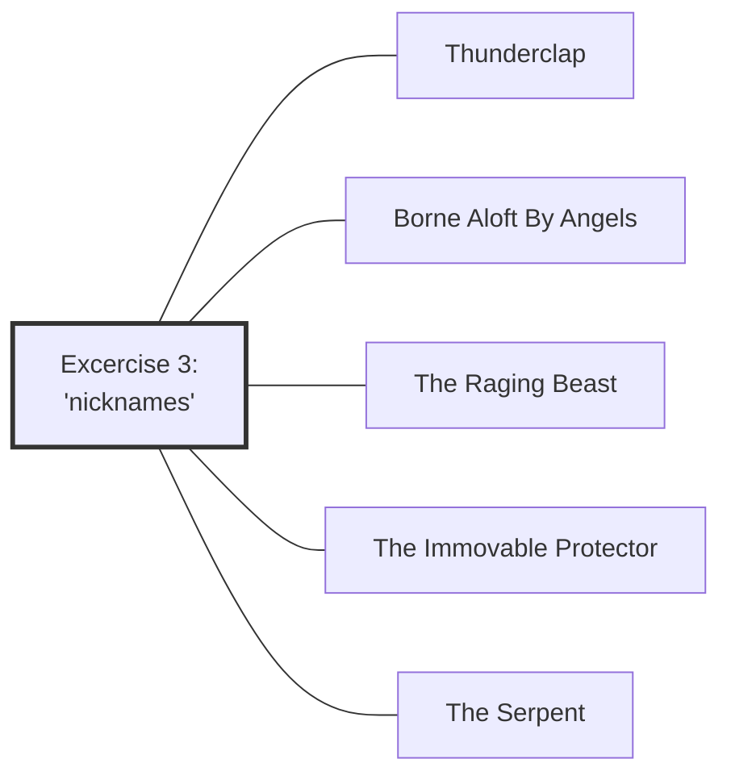

#Talk

[[Preliminaries Regarding Voice, Movement, and Gesture - Part 1|Preliminaries Regarding Voice, Movement, and Gesture - Part 1 🡄]] | [[2020 Vajra Music|🡅]] | [[Preliminaries Regarding Voice, Movement, and Gesture - Part 3|🡆 Preliminaries Regarding Voice, Movement, and Gesture - Part 3]]

Series: [[2020 Vajra Music]]
Transcript: [[0302 Preliminaries Regarding Voice, Movement, and Gesture - Part 2]]
Transcript PDF: [[2020_0302 Preliminaries Regarding Voice, Movement, and Gesture - Part 2.pdf]]

![[20200302-Rob_Burbea-GAIA-preliminaries_regarding_voice_movement_and_gesture_part_2-62453.mp3]]



## Index
<span class="counts">_[[Embodiment]] (95) · [[Soul]] (88) · [[Image]] (62) · [[Retreat]] (34) · [[Soulmaking]] (30) · [[Energy body]] (28) · [[Circuits]] (22) · [[Daimon]] (22) · [[Imaginal]] (17) · [[Anger]] (15) · [[Experience]] (14) · [[Soulmaking dynamic]] (14) · [[Energy]] (13) · [[Dharma]] (12) · [[Preliminaries]] (12) · [[Mind]] (10) · [[Eros]] (9) · [[Inertia]] (8) · [[Sankhara]] (7) · [[Duty]] (6) · [[Pedagogy]] (6) · [[The Self]] (6) · [[Thunderclap]] (6) · [[Meditation]] (5) · [[The Immovable Protector]] (5) · [[Ethics]] (4) · [[Goenka]] (4) · [[Grief]] (4) · [[Manifestations]] (4) · [[Music]] (4) · [[Music#Jazz]] (4) · [[The Serpent]] (4) · [[Alchemy]] (3) · [[Diamond Approach]] (3) · [[Dukkha]] (3) · [[Habit]] (3) · [[Insight]] (3) · [[Sila]] (3) · [[Sociology]] (3) · [[Awareness]] (2) · [[Beauty]] (2) · [[Borne Aloft By Angels]] (2) · [[Citta]] (2) · [[Contraction]] (2) · [[Devotion]] (2) · [[Dominant culture]] (2) · [[Hindrances]] (2) · [[Juiciness]] (2) · [[Love]] (2) · [[Mindfulness]] (2) · [[Pain]] (2) · [[Personhood]] (2) · [[Precepts]] (2) · [[Psyche]] (2) · [[The Spreading of Five Wings]] (2) · [[Vessel]] (2) · [[Voice, Movement, and the Possibilities of Soul]] (2) · [[Buddhism]] · [[Catherine McGee]] · [[Create-Discover]] · [[Dana]] · [[Dharma Seed]] · [[Dimensionality]] · [[Fantasy]] · [[Foundations of a Soulmaking Dharma]] · [[Gaia House]] · [[Impermanence]] · [[In Psyche's Orchard]] · [[Logos]] · [[Metta]] · [[Middle Way]] · [[Passion]] · [[Receptivity]] · [[Relationships]] · [[Sangha]] · [[Sila and Soul]] · [[Spirituality]] · [[The Image of Ethics]] · [[The Raging Beast]] · [[Theravada]] · [[Wonder]]_</span>
<br/>

## Referenced talks
- [[Daimon, Refracted]]
- [[Voice, Movement, and the Possibilities of Soul]]
- [[Sila and Soul]]
- [[The Image of Ethics]]
- [[The Spreading of Five Wings]]
- [[Pain, as Void and as Sacrament]]

## Paragraphs
[[Preliminaries Regarding Voice, Movement, and Gesture - Part 2 -|plain list]]

### Intro
##### Third set of excercises, but a few general things first
<span class="counts">[[0302 Preliminaries Regarding Voice, Movement, and Gesture - Part 2#^1-1|1-1]]</span>

---
##### "Daimon, Refracted" 🟢
<span class="counts">**[[0302 Preliminaries Regarding Voice, Movement, and Gesture - Part 2#^1-2|1-2]]**: _[[Embodiment]] (2) · [[Retreat]] · [[Meditation]] · [[Soulmaking]]_</span>

references [[Daimon, Refracted]]

---
##### "Voice, Movement, and the Possibilities of Soul" ... but how many have picked it up? 🟢
<span class="counts">**[[0302 Preliminaries Regarding Voice, Movement, and Gesture - Part 2#^1-3|1-3]]**: _[[Retreat]] · [[Foundations of a Soulmaking Dharma]] · [[Dharma Seed]] · [[Voice, Movement, and the Possibilities of Soul]]_</span>

---
##### If not, why not?
<span class="counts">**[[0302 Preliminaries Regarding Voice, Movement, and Gesture - Part 2#^1-4|1-4]]**: _[[Inertia]] · [[Energy]] · [[Meditation]]_</span>

```ad-tip
revisits [[Inertia]]
```

---
##### "Why not?" points to failing to discriminate/discern signifiance
<span class="counts">**[[0302 Preliminaries Regarding Voice, Movement, and Gesture - Part 2#^2-1|2-1]]**: _[[Inertia]] (2)_</span>

---
##### The question also sheds light on pedagogy
<span class="counts">**[[0302 Preliminaries Regarding Voice, Movement, and Gesture - Part 2#^2-2|2-2]]**: _[[Pedagogy]] (2) · [[Mind]] · [[Inertia]]_</span>

---
##### Recap from yesterday: it's about sensitivity
<span class="counts">**[[0302 Preliminaries Regarding Voice, Movement, and Gesture - Part 2#^2-3|2-3]]**: _[[Soulmaking]] (2) · [[Energy body]]_</span>

---
##### We are often held back or holding in of our energy
<span class="counts">**[[0302 Preliminaries Regarding Voice, Movement, and Gesture - Part 2#^2-4|2-4]]**: _[[The Self]] · [[Sociology]] · [[Energy]] (4) · [[Embodiment]] (2) · [[Sankhara]] (7) · [[Eros]] (3) · [[Soul]] (2) · [[Dominant culture]] · [[Dharma]]_</span>

---
##### "Preliminaries" can become ensouled
<span class="counts">**[[0302 Preliminaries Regarding Voice, Movement, and Gesture - Part 2#^3-1|3-1]]**: _[[Preliminaries]] (7) · [[Mindfulness]] · [[Energy body]] · [[Soul]] · [[Retreat]]_</span>

---
##### Energy body excercises open towards relating to it as imaginal image
<span class="counts">**[[0302 Preliminaries Regarding Voice, Movement, and Gesture - Part 2#^3-2|3-2]]**: _[[Soul]] (4) · [[Preliminaries]] · [[Energy body]] (4) · [[Awareness]] (2) · [[Embodiment]] · [[Imaginal]] (4)_</span>

---
##### "Sila and Soul", "The Image of Ethics" 🟢
<span class="counts">**[[0302 Preliminaries Regarding Voice, Movement, and Gesture - Part 2#^3-3|3-3]]**: _[[Sila]] (3) · [[Ethics]] (4) · [[Dharma]] (3) · [[Precepts]] (2) · [[Theravada]] · [[Buddhism]] · [[Sila and Soul]] · [[The Image of Ethics]] · [[Soulmaking dynamic]] · [[Imaginal]] · [[Soul]] (2) · [[Dimensionality]] · [[Beauty]]_</span>

---
##### Why "preliminaries"? Because it expands soulmaking
<span class="counts">**[[0302 Preliminaries Regarding Voice, Movement, and Gesture - Part 2#^3-4|3-4]]**: _[[Soul]] · [[Dana]] · [[Mindfulness]] · [[Preliminaries]] (3) · [[Soulmaking dynamic]] (2) · [[Experience]] (2) · [[Insight]] · [[Vessel]]_</span>

---
##### If we like practicing soulmaking the soulmaking dynamic will expand
<span class="counts">**[[0302 Preliminaries Regarding Voice, Movement, and Gesture - Part 2#^4-1|4-1]]**: _[[Soulmaking]] · [[Soulmaking dynamic]] (2) · [[Vessel]] · [[Embodiment]]_</span>

![[20200302-Rob_Burbea-GAIA-preliminaries_regarding_voice_movement_and_gesture_part_2-62453.mp3#t=15:46]]

---
##### There can be blocks which are too entrenched
<span class="counts">**[[0302 Preliminaries Regarding Voice, Movement, and Gesture - Part 2#^4-2|4-2]]**: _[[Embodiment]] (2) · [[Soulmaking dynamic]] (5) · [[Eros]] (3) · [[Psyche]] · [[Logos]] · [[Soul]]_</span>

---
##### Those areas remain out of reach
<span class="counts">**[[0302 Preliminaries Regarding Voice, Movement, and Gesture - Part 2#^4-3|4-3]]**: _[[Soulmaking dynamic]] (2) · [[Create-Discover]] · [[Soul]] (2)_</span>

---
##### What does it mean for movement/gesture/voice to be ensouled?
<span class="counts">**[[0302 Preliminaries Regarding Voice, Movement, and Gesture - Part 2#^4-4|4-4]]**: _[[Embodiment]] (2) · [[Soul]] (2)_</span>

![[20200302-Rob_Burbea-GAIA-preliminaries_regarding_voice_movement_and_gesture_part_2-62453.mp3#t=19:22]]

---
##### There are roads that are open
<span class="counts">**[[0302 Preliminaries Regarding Voice, Movement, and Gesture - Part 2#^4-5|4-5]]**: _[[Soul]] (8) · [[Embodiment]] (4) · [[Music]]_</span>

---
##### (1) If soul wants to manifest, it can
<span class="counts">**[[0302 Preliminaries Regarding Voice, Movement, and Gesture - Part 2#^5-1|5-1]]**: _[[Soul]] (7) · [[Embodiment]]_</span>

What does it mean for movement/gesture/voice to be ensouled?
1. if soul wants to manifest, it can
2. ordinary usages of movement/gesture/voice can be sensed with soul

```ad-quote
So _if_ it wants to express and communicate through and using those aspects of being, if soul wants that, it _can_. ... There's not something that bars those directions and domains from being ensouled, bars soul from flowing through and expressing and communicating in and through and with those aspects of our being.
```

---
##### (2) Ordinary usages of movement/gesture/voice can be sensed with soul
<span class="counts">**[[0302 Preliminaries Regarding Voice, Movement, and Gesture - Part 2#^5-2|5-2]]**: _[[Embodiment]] (3) · [[Soul]] (4) · [[Daimon]] (2) · [[Soulmaking]]_</span>

```ad-quote
A second thing that it means is that the movement, gesture, and voice of oneself or of another, in their everyday, ordinary usages - just the voice speaking, or just having a conversation, or exclaiming something, or the hand moving as it speaks, or whatever it is - those ordinary usages of movement, of gesture, of voice can be sensed with soul, can be sensed, therefore, as angelic, as refracting the [[Daimon|angel]], the daimon. 
```

---
##### With regard to the "grief", there were plenty of things within jazz that I figured out on my own
<span class="counts">**[[0302 Preliminaries Regarding Voice, Movement, and Gesture - Part 2#^5-3|5-3]]**: _[[Grief]] (3) · [[Music#Jazz]] (4) · [[Music]] · [[Eros]]_</span>

[[Preliminaries Regarding Voice, Movement, and Gesture - Part 1#Soul-grief from not practicing being fluid]]

---
##### I could have just kept bashing away, but I didn't
<span class="counts">**[[0302 Preliminaries Regarding Voice, Movement, and Gesture - Part 2#^5-4|5-4]]**: _[[Music]] · [[Pedagogy]]_</span>

```ad-quote
Yes, I wasn't taught it, because, as I said, there wasn't the [[pedagogy]] there at that time. But I could have just kept bashing away in this dogged way that one has if one really wants something. I didn't. I chose other things instead. So there's regret. There's some responsibility that falls on me.
```

---
##### So practice in a way that you don't end up regretting
<span class="counts">**[[0302 Preliminaries Regarding Voice, Movement, and Gesture - Part 2#^6-1|6-1]]**: _[[Soulmaking]] (2) · [[Soul]] (3)_</span>

```ad-quote
In a way, I'm offering these particular teachings now, offering them so that there's the possibility that you can practise, and practise in a way that you don't end up regretting, that you don't end up regretting not supporting yourself fully, or allowing yourself or enabling yourself fully to move in the direction or be moved in the direction of what _you_ want with respect to [[Soulmaking|Soulmaking Dharma]], and also what you want with respect to [[soul]] in life, the expression and the living of soul in life, _your_ soul in _your_ life. We must call that Soulmaking Dharma; it's not something separate.
```

---
##### We need to take care about the basic nuts and bolts
<span class="counts">**[[0302 Preliminaries Regarding Voice, Movement, and Gesture - Part 2#^6-2|6-2]]**: _[[Grief]] · [[Soul]]_</span>

![[20200302-Rob_Burbea-GAIA-preliminaries_regarding_voice_movement_and_gesture_part_2-62453.mp3#t=28:15]]

---
##### What does hearing about preliminaries do to you? First extreme: never bother
<span class="counts">**[[0302 Preliminaries Regarding Voice, Movement, and Gesture - Part 2#^6-3|6-3]]**: _[[Embodiment]] · [[Preliminaries]]_</span>

---
##### Second extreme: spend hours and years on them before doing something else
<span class="counts">**[[0302 Preliminaries Regarding Voice, Movement, and Gesture - Part 2#^6-4|6-4]]**: _[[Middle Way]] · [[Inertia]] · [[Insight]]_</span>

---
##### And always listen to you body, adapt it if necessary
<span class="counts">**[[0302 Preliminaries Regarding Voice, Movement, and Gesture - Part 2#^6-5|6-5]]**: _[[Embodiment]] (5)_</span>

---
### Excercise 3
##### Excercise 3 has 5 parts
<span class="counts">**[[0302 Preliminaries Regarding Voice, Movement, and Gesture - Part 2#^7-1|7-1]]**: _[[Energy body]] (3) · [[Image]]_</span>

==variations==
- do it concretely, physically
- do it just with the energy body, with the image-sense

---
##### The parts have nicknames
<span class="counts">[[0302 Preliminaries Regarding Voice, Movement, and Gesture - Part 2#^7-2|7-2]]</span>

---
#### 🟡 Excercise 3.1: _Thunderclap_
##### This was the one which started it all
<span class="counts">**[[0302 Preliminaries Regarding Voice, Movement, and Gesture - Part 2#^7-4|7-4]]**: _[[Thunderclap]] (2)_</span>

![[20200302-Rob_Burbea-GAIA-preliminaries_regarding_voice_movement_and_gesture_part_2-62453.mp3#t=33:34]]

```ad-danger
title: Interesting
This one was the one which made Rob compile those offerings, so it's really, really important
```

---
##### Emphatic gesture
<span class="counts">**[[0302 Preliminaries Regarding Voice, Movement, and Gesture - Part 2#^7-5|7-5]]**: _[[Energy]] (2) · [[Soul]] (5) · [[Imaginal]] · [[Eros]] · [[Mind]] · [[Embodiment]] (3)_</span>
- relativly short
- maybe with vocalization
- emphatic, i.e. force, energy, strength in it
- soul is coming through

---
##### Thunderclap examples
<span class="counts">**[[0302 Preliminaries Regarding Voice, Movement, and Gesture - Part 2#^7-6|7-6]]**: _[[Mind]] · [[Embodiment]] (3)_</span>
- stamp the foot
- gesture with arms or fists
- kick
- karate chop

=> needs coming togehter, coherence, congruence

---
##### ==variations==
<span class="counts">[[0302 Preliminaries Regarding Voice, Movement, and Gesture - Part 2#^7-7|7-7]]</span>

```ad-quote
you don't actually know what you're going to do. You just feel the impulse, and let that coalesce, and let it come out. Or it could be it's a precise move. You've rehearsed it, and you know exactly what it looks like and what it's going to sound like, and you do that. Those two alternatives will apply to all of these five examples.
```
- sponteneous
- rehearsed

=> up to fifteen seconds, then kind of gathering (citta, energy body, awareness), stopping, regrouping. Then another burst

**"Phet"**
- https://www.youtube.com/watch?v=iqNhj5QL5GA&ab_channel=RoamingYogi
- https://www.youtube.com/watch?v=ycK9s495xlY&ab_channel=PemakoBuddhism
- https://www.youtube.com/watch?v=0VeK_XCyRRc&ab_channel=PemakoBuddhism

---
##### Bring everything together: mind, intention, soul, body
<span class="counts">**[[0302 Preliminaries Regarding Voice, Movement, and Gesture - Part 2#^8-1|8-1]]**: _[[Mind]] · [[Soul]] · [[Embodiment]]_</span>

---
##### You assess it first (the student)
<span class="counts">**[[0302 Preliminaries Regarding Voice, Movement, and Gesture - Part 2#^8-2|8-2]]**: _[[Retreat]] (4) · [[Thunderclap]] (2) · [[Embodiment]] · [[Energy]]_</span>

---
##### Then I assess it (the teacher)
<span class="counts">**[[0302 Preliminaries Regarding Voice, Movement, and Gesture - Part 2#^8-3|8-3]]**: _[[Dominant culture]] · [[Dharma]] (2) · [[Retreat]] (2)_</span>

```ad-quote
But I think even the ability to really read these things in another person and sense them is also quite rare ... For most people, it will probably only develop through practice and through doing it oneself. Then some people will develop the ability to sort of get a sense with other people. We can be easily misled in these areas, very easily misled.
```

---
##### "I'll come back to what's this assessment bit about" ^assessment-1
<span class="counts">**[[0302 Preliminaries Regarding Voice, Movement, and Gesture - Part 2#^8-4|8-4]]**: _[[Retreat]] (2) · [[Meditation]] · [[Energy body]] · [[Imaginal]] · [[Gaia House]]_</span>

see [[Preliminaries Regarding Voice, Movement, and Gesture - Part 2#^assessment-2|below]]

---
#### 🟡 Excercise 3.2: _Borne Aloft by Angels_
##### Make your body buoyant
<span class="counts">**[[0302 Preliminaries Regarding Voice, Movement, and Gesture - Part 2#^9-1|9-1]]**: _[[Borne Aloft By Angels]] (2) · [[Embodiment]] (4) · [[Image]] · [[Love]]_</span>
==timing==
- max 2 minutes
- certainly >20 seconds
- either 2 minutes straight or 15s bursts

---
##### Be moved by these angels
<span class="counts">**[[0302 Preliminaries Regarding Voice, Movement, and Gesture - Part 2#^9-2|9-2]]**: _[[Embodiment]] (6) · [[Daimon]] (2) · [[Energy body]] · [[Soul]] · [[Retreat]]_</span>
- express with body of being borne aloft
- weightless angels carry me => soaring
- held up by gossamer threads of love and light
- almost as if we celebrate something
- body becomes fluid
- surrendering
- carried by people in a concert
- being held and being moved

---
#### 🟡 Excercise 3.3: _The Raging Beast_
##### Different types of beasts
<span class="counts">**[[0302 Preliminaries Regarding Voice, Movement, and Gesture - Part 2#^9-3|9-3]]**: _[[The Raging Beast]] · [[Mind]]_</span>
==variations==
- only raging
- with horns, fangs
- _a_ raging beast vs _the_

---
##### Gather the citta, then another burst
<span class="counts">**[[0302 Preliminaries Regarding Voice, Movement, and Gesture - Part 2#^9-4|9-4]]**: _[[Hindrances]] (2) · [[Embodiment]] (2) · [[Citta]] · [[Energy body]]_</span>

---
##### Vocalization is possible, not necessary - - get more discriminating
<span class="counts">**[[0302 Preliminaries Regarding Voice, Movement, and Gesture - Part 2#^9-5|9-5]]**: _[[Embodiment]]_</span>

---
#### 🟡 Excercise 3.4: _The Immovable Protector_
##### Human? Angel? Mythic Figure? What are they protecting?
<span class="counts">**[[0302 Preliminaries Regarding Voice, Movement, and Gesture - Part 2#^9-6|9-6]]**: _[[The Immovable Protector]] (4) · [[Fantasy]] · [[Sociology]] (2) · [[Embodiment]]_</span>

![[20200302-Rob_Burbea-GAIA-preliminaries_regarding_voice_movement_and_gesture_part_2-62453.mp3#t=46:55]]

==variations==
- type of guardian
	- human guardan
	- inhuman
	- demonic
	- angelic
	- animal
	- mythic creature
- what's protected?
	- earth
	- social justice
- modes might change from time to time

---
##### Modalities
<span class="counts">**[[0302 Preliminaries Regarding Voice, Movement, and Gesture - Part 2#^10-1|10-1]]**: _[[The Immovable Protector]] · [[Energy body]] (2) · [[Mind]] · [[Soul]] · [[Image]]_</span>
==variations==
- range of movement
	- immovable
	- little movement
	- a lot of movement
	- no movement
- stance
- posture

---
##### 🟡 Excercise 3.5: _The Serpent_
<span class="counts">**[[0302 Preliminaries Regarding Voice, Movement, and Gesture - Part 2#^10-2|10-2]]**: _[[The Serpent]] (4)_</span>

![[20200302-Rob_Burbea-GAIA-preliminaries_regarding_voice_movement_and_gesture_part_2-62453.mp3#t=49:02]]

[[Preliminaries Regarding Voice, Movement, and Gesture - Part 4#^the-serpent]]

---
##### Summary of some modalities
<span class="counts">**[[0302 Preliminaries Regarding Voice, Movement, and Gesture - Part 2#^10-3|10-3]]**: _[[Energy body]] · [[Imaginal]] (2) · [[Image]] · [[Embodiment]]_</span>

---
##### Excercise 3 ends
<span class="counts">[[0302 Preliminaries Regarding Voice, Movement, and Gesture - Part 2#^10-4|10-4]]</span>

![[20200302-Rob_Burbea-GAIA-preliminaries_regarding_voice_movement_and_gesture_part_2-62453.mp3#t=50:32]]

---
### Again: Why?
##### Ability to gather momentum (e.g. for Thunderclap) is quite rare
<span class="counts">**[[0302 Preliminaries Regarding Voice, Movement, and Gesture - Part 2#^10-5|10-5]]**: _[[Passion]] · [[Thunderclap]] (2) · [[Citta]] · [[Soul]] · [[Mind]] · [[Embodiment]] · [[Energy]] · [[Wonder]] · [[Dharma]] (2)_</span>

---
##### Circuits aren't connected, and it limits what arises imaginally
<span class="counts">**[[0302 Preliminaries Regarding Voice, Movement, and Gesture - Part 2#^10-6|10-6]]**: _[[Embodiment]] · [[Mind]] · [[Energy]] · [[Soul]] · [[Circuits]] (5) · [[Image]] (7) · [[Soulmaking]] (2) · [[Imaginal]] · [[Soulmaking dynamic]] (2)_</span>

---
##### This affects the whole psyche, heart, relation to others
<span class="counts">**[[0302 Preliminaries Regarding Voice, Movement, and Gesture - Part 2#^11-1|11-1]]**: _[[Circuits]] (2) · [[Image]] (5) · [[Embodiment]] · [[Energy body]] · [[The Self]] · [[Soulmaking]] (4) · [[Meditation]] · [[Soul]] (4) · [[Duty]] · [[Psyche]] · [[Relationships]]_</span>

---
##### It also affects the decision to practice these kind of excercises
<span class="counts">**[[0302 Preliminaries Regarding Voice, Movement, and Gesture - Part 2#^11-2|11-2]]**: _[[Circuits]] · [[Soulmaking]] · [[Soul]]_</span>

---
##### So careful if you feel resistance to some of these excercises
<span class="counts">[[0302 Preliminaries Regarding Voice, Movement, and Gesture - Part 2#^11-3|11-3]]</span>

```ad-quote
Just an invitation to really ponder: is there something, a much larger trajectory, absence of trajectory here, in one's life - patterning, limitation, blind spots, incapacities, impossibilities? You can do what you want, but just the invitation to take care, and to really inquire into that.
```

---
##### Why would you neglect to practice this?
<span class="counts">**[[0302 Preliminaries Regarding Voice, Movement, and Gesture - Part 2#^12-1|12-1]]**: _[[Image]] · [[Energy body]] · [[Embodiment]]_</span>

---
##### There are consequences to neglecting
<span class="counts">**[[0302 Preliminaries Regarding Voice, Movement, and Gesture - Part 2#^12-2|12-2]]**: _[[Image]] · [[Energy body]] · [[Embodiment]] · [[Manifestations]] · [[Soulmaking]] · [[Inertia]]_</span>

```ad-quote
There will be consequences to neglecting, not picking up, and just kind of giving in to one's [[inertia]] without really examining it and questioning it.
```

---
##### "Do I really know what's going on for me here?"
<span class="counts">[[0302 Preliminaries Regarding Voice, Movement, and Gesture - Part 2#^12-3|12-3]]</span>

---
##### It may take repeated practice to reopen the circuits
<span class="counts">**[[0302 Preliminaries Regarding Voice, Movement, and Gesture - Part 2#^12-4|12-4]]**: _[[Circuits]] (3) · [[Soul]] · [[Embodiment]] (2)_</span>

![[20200302-Rob_Burbea-GAIA-preliminaries_regarding_voice_movement_and_gesture_part_2-62453.mp3#t=1:01:50]]

---
##### It's not about self-empowerment or catharsis, it's to let soul do what soul wants
<span class="counts">**[[0302 Preliminaries Regarding Voice, Movement, and Gesture - Part 2#^12-5|12-5]]**: _[[Anger]] · [[Soul]] (3) · [[Image]] (2) · [[Energy body]] (2) · [[Duty]] (2)_</span>

---
##### And it's about everyday sensing with soul
<span class="counts">**[[0302 Preliminaries Regarding Voice, Movement, and Gesture - Part 2#^13-1|13-1]]**: _[[Retreat]] · [[Embodiment]] · [[Soul]] (2)_</span>

---
##### Why this business about assessment? ^assessment-2
<span class="counts">**[[0302 Preliminaries Regarding Voice, Movement, and Gesture - Part 2#^13-2|13-2]]**: _[[Dharma]] (3) · [[Retreat]] · [[The Self]] · [[Manifestations]] (2) · [[Soul]] · [[Energy]] · [[Embodiment]]_</span>

see [[Preliminaries Regarding Voice, Movement, and Gesture - Part 2#^assessment-1|above]] 

---
##### Because it makes it more challenging, and fit for life
<span class="counts">**[[0302 Preliminaries Regarding Voice, Movement, and Gesture - Part 2#^13-3|13-3]]**: _[[Soul]] (2)_</span>

```ad-quote
Putting that piece in, the assessment, the sort of exam piece, actually makes it more difficult, usually, and more challenging, and that's actually part of it, because that reflects, mimics, the actual situation that [[soul]] finds itself in in life. Soul is in life. That's what we need to work with.
```

---
##### It seems to be difficult to understand why we are introducing those excercises
<span class="counts">[[0302 Preliminaries Regarding Voice, Movement, and Gesture - Part 2#^13-4|13-4]]</span>

---
##### Sometimes yogis need me to demonstrate it, and/or they forget it
<span class="counts">**[[0302 Preliminaries Regarding Voice, Movement, and Gesture - Part 2#^13-5|13-5]]**: _[[Embodiment]] · [[Insight]] · [[Habit]]_</span>

---
##### Sometimes there's a lack of sensitivity to the energy body
<span class="counts">**[[0302 Preliminaries Regarding Voice, Movement, and Gesture - Part 2#^13-6|13-6]]**: _[[Energy body]] · [[Energy]] · [[Embodiment]] (2)_</span>

---
##### Loud Heavy Metal or Punk voices can still be contracted
<span class="counts">**[[0302 Preliminaries Regarding Voice, Movement, and Gesture - Part 2#^14-1|14-1]]**: _[[Contraction]] (2) · [[Embodiment]]_</span>

---
##### There are singers whose energy is fully inhabiting the space they are in
<span class="counts">**[[0302 Preliminaries Regarding Voice, Movement, and Gesture - Part 2#^14-2|14-2]]**: _[[Embodiment]] (4) · [[Energy]]_</span>

---
##### Doing the excercises can feel alien or comical, or  go against what's associated with spirituality 🟢
<span class="counts">**[[0302 Preliminaries Regarding Voice, Movement, and Gesture - Part 2#^14-3|14-3]]**: _[[Retreat]] · [[Voice, Movement, and the Possibilities of Soul]] · [[Embodiment]] · [[Spirituality]] · [[Dharma]]_</span>

---
##### It's something that can be strikingly underdeveloped for practitioners
<span class="counts">[[0302 Preliminaries Regarding Voice, Movement, and Gesture - Part 2#^14-4|14-4]]</span>

![[20200302-Rob_Burbea-GAIA-preliminaries_regarding_voice_movement_and_gesture_part_2-62453.mp3#t=1:14:23]]

---
##### Interview situation: opening up to a whole new sense of self, "wow"
<span class="counts">**[[0302 Preliminaries Regarding Voice, Movement, and Gesture - Part 2#^14-5|14-5]]**: _[[Dukkha]] (3) · [[Energy body]] (4) · [[Image]] (3) · [[Alchemy]] (2) · [[The Self]] · [[Embodiment]]_</span>

---
##### The new capacity often reverts back to the usual shapes and structures
<span class="counts">**[[0302 Preliminaries Regarding Voice, Movement, and Gesture - Part 2#^15-1|15-1]]**: _[[The Self]] (2) · [[Embodiment]] · [[Experience]] (2) · [[Alchemy]] · [[Energy body]] · [[Image]] (3) · [[Beauty]] · [[Soul]]_</span>

---
##### The excercises here are more like scales and technical excercises, not "wow"
<span class="counts">**[[0302 Preliminaries Regarding Voice, Movement, and Gesture - Part 2#^15-2|15-2]]**: _[[Experience]]_</span>

---
##### Dramatic "wow" experiences do not necessarily make long-term differences
<span class="counts">**[[0302 Preliminaries Regarding Voice, Movement, and Gesture - Part 2#^15-3|15-3]]**: _[[Pedagogy]] · [[Meditation]] · [[Retreat]]_</span>

---
##### What does make a difference is a practice that's helpful and has eros for me
<span class="counts">**[[0302 Preliminaries Regarding Voice, Movement, and Gesture - Part 2#^15-4|15-4]]**: _[[Retreat]] (3) · [[Experience]] (2) · [[Eros]]_</span>

---
##### Just every day, getting on a track
<span class="counts">**[[0302 Preliminaries Regarding Voice, Movement, and Gesture - Part 2#^15-5|15-5]]**: _[[Retreat]] (3)_</span>

```ad-quote
 just every day, getting on a track, something that I'm really interested in, and repeating it, developing it, growing with it. So that would be more my answer to what has really made a genuine, long-term difference in helpful ways, different kinds of helpful ways.
```

---
##### How much do "wow" experiences overlap with what makes long-term differences?
<span class="counts">[[0302 Preliminaries Regarding Voice, Movement, and Gesture - Part 2#^16-1|16-1]]</span>

---
##### Goenka retreat as high-discipline prison
<span class="counts">**[[0302 Preliminaries Regarding Voice, Movement, and Gesture - Part 2#^16-2|16-2]]**: _[[Retreat]] (2) · [[Goenka]] (2) · [[Pain]]_</span>

---
##### This can break the momentum of unhelpful patterns
<span class="counts">**[[0302 Preliminaries Regarding Voice, Movement, and Gesture - Part 2#^16-3|16-3]]**: _[[Goenka]] (2) · [[Retreat]] · [[Habit]]_</span>

---
##### In this case "wow" can lead to long-term change - - but how about beautiful soulmaking or metta retreats?
<span class="counts">**[[0302 Preliminaries Regarding Voice, Movement, and Gesture - Part 2#^16-4|16-4]]**: _[[Experience]] (5) · [[Retreat]] (8) · [[Soulmaking]] (2) · [[Metta]]_</span>

---
##### Maybe steady courses, classes, groups can provide a different kind of support
<span class="counts">**[[0302 Preliminaries Regarding Voice, Movement, and Gesture - Part 2#^17-1|17-1]]**: _[[Sangha]] · [[Soulmaking]] (3) · [[Pedagogy]] (2) · [[Retreat]] · [[Experience]] · [[Soul]] (2)_</span>

```ad-quote
Beautiful as the [[experience]] of that week can be, or some of the experiences on that week can be, and touching, might it be that something more steady - courses, classes, groups, etc. - actually provide maybe not _more_ support, but a different kind of support, and a necessary kind of support for making a real, more long-term difference in terms of [[soul]] and soulmaking and what soul needs? That's something to think about.
```

---
##### Simile: stuck keys on a piano
<span class="counts">**[[0302 Preliminaries Regarding Voice, Movement, and Gesture - Part 2#^17-2|17-2]]**: _[[Experience]] · [[Image]] · [[Music]]_</span>

---
##### The soul needs the circuits to be connected
<span class="counts">**[[0302 Preliminaries Regarding Voice, Movement, and Gesture - Part 2#^17-3|17-3]]**: _[[Soul]] (4) · [[Circuits]] · [[Embodiment]]_</span>

---
##### Sometimes we don't let certain expressions of movement/gesture/voice into the body
<span class="counts">**[[0302 Preliminaries Regarding Voice, Movement, and Gesture - Part 2#^17-4|17-4]]**: _[[Embodiment]] (5) · [[Manifestations]]_</span>

---
##### we want the whole range of images to be available 🟢
<span class="counts">**[[0302 Preliminaries Regarding Voice, Movement, and Gesture - Part 2#^17-5|17-5]]**: _[[Image]] (11) · [[Soul]] (3) · [[Embodiment]] (3) · [[Imaginal]] (2) · [[The Spreading of Five Wings]] (2) · [[Inertia]]_</span>

```ad-quote
Soul wants the whole palette to be available for its art. And it wants that not just in imaginal practice, but also in the body and in the voice, and the [[Embodiment|expressions of body]] and voice, movement and gesture, etc. 
```

---
##### Closed circuit might lead to black-and-white thinking
<span class="counts">**[[0302 Preliminaries Regarding Voice, Movement, and Gesture - Part 2#^18-1|18-1]]**: _[[Soul]] · [[Embodiment]] (4) · [[Anger]] (5) · [[Circuits]] (2) · [[Mind]] (2) · [[Image]] · [[Habit]]_</span>

![[20200302-Rob_Burbea-GAIA-preliminaries_regarding_voice_movement_and_gesture_part_2-62453.mp3#t=1:33:03]]

```ad-quote
And that's something that often goes with anger when anger is not so healthy: it gets very black and white, the thinking and the viewing. But there may well be a relationship between the prevention, the absence, the block, the non-existence of those circuits of movement, gesture, and voice, and the entrenchment and habit of black-and-white thinking and viewing...
```

---
##### It can also get brittle
<span class="counts">**[[0302 Preliminaries Regarding Voice, Movement, and Gesture - Part 2#^18-2|18-2]]**: _[[Embodiment]] (2) · [[Anger]]_</span>

---
##### The anger can be brittle and not have depth to it
<span class="counts">**[[0302 Preliminaries Regarding Voice, Movement, and Gesture - Part 2#^18-3|18-3]]**: _[[Anger]] (7) · [[Juiciness]] (2) · [[Circuits]] · [[Embodiment]]_</span>

---
##### Something can shatter in an unhelpful way
<span class="counts">**[[0302 Preliminaries Regarding Voice, Movement, and Gesture - Part 2#^18-4|18-4]]**: _[[Anger]] · [[Circuits]] · [[Embodiment]]_</span>

---
##### When to concretize an image of a ritual in an actual one? 🟢
<span class="counts">**[[0302 Preliminaries Regarding Voice, Movement, and Gesture - Part 2#^19-1|19-1]]**: _[[Pain]] · [[In Psyche's Orchard]] · [[Energy body]] · [[Image]]_</span>

referenced [[Pain, as Void and as Sacrament]]

---
##### When does an image need to be concretized in movement, gesture, voice?
<span class="counts">**[[0302 Preliminaries Regarding Voice, Movement, and Gesture - Part 2#^19-2|19-2]]**: _[[Embodiment]] (5) · [[Image]] (5) · [[Soulmaking]] (4) · [[Energy body]] · [[Soul]]_</span>

---
##### What's the most soulmaking in the more long-term?
<span class="counts">**[[0302 Preliminaries Regarding Voice, Movement, and Gesture - Part 2#^19-3|19-3]]**: _[[Soulmaking]] (2) · [[Soul]] · [[Receptivity]] · [[Inertia]]_</span>

---
##### 2 temporalities
<span class="counts">**[[0302 Preliminaries Regarding Voice, Movement, and Gesture - Part 2#^19-4|19-4]]**: _[[Image]] (3) · [[Soulmaking]] (2) · [[Embodiment]]_</span>
- what allows the image to become more soulmaking _now_?
- what is it that allows a fuller soulmaking in my life, over the _long term_?

---
##### The image needs to be refracted into duty - - are the circuits working?
<span class="counts">**[[0302 Preliminaries Regarding Voice, Movement, and Gesture - Part 2#^19-5|19-5]]**: _[[Image]] (2) · [[Embodiment]] (2) · [[Duty]] (2) · [[Circuits]]_</span>

---
##### Sometimes something is so cut that we don't even feel the soul's want
<span class="counts">**[[0302 Preliminaries Regarding Voice, Movement, and Gesture - Part 2#^19-6|19-6]]**: _[[Soul]] (5) · [[Embodiment]] (2) · [[Circuits]] (3)_</span>

```ad-quote
Sometimes something is so cut that we don't even feel the soul's want. If the circuit is alive, we're more likely to be able to feel the soul want, the soul's want, if there is one. Then we can make the choice. Then we can listen better.
```

---
##### Blocks are normal. The angels come, and they help.
<span class="counts">**[[0302 Preliminaries Regarding Voice, Movement, and Gesture - Part 2#^20-1|20-1]]**: _[[Personhood]] · [[Soul]] (2) · [[Daimon]] (3) · [[Image]] (5) · [[Imaginal]] (2) · [[Embodiment]]_</span>

![[20200302-Rob_Burbea-GAIA-preliminaries_regarding_voice_movement_and_gesture_part_2-62453.mp3#t=1:45:03]]

---
##### Diamond Approach: "impeccability"
<span class="counts">**[[0302 Preliminaries Regarding Voice, Movement, and Gesture - Part 2#^20-2|20-2]]**: _[[Diamond Approach]] (3) · [[Catherine McGee]] · [[Daimon]] (4) · [[Love]] · [[Imaginal]] (3) · [[Soul]] (2) · [[Devotion]] · [[Image]]_</span>

![[20200302-Rob_Burbea-GAIA-preliminaries_regarding_voice_movement_and_gesture_part_2-62453.mp3#t=1:46:42]]

```ad-quote
... what they really mean is ... the capacity to really be steady and grounded and consistent and follow through with your plans or what you said, honour your word - if you said you would do this, to really do it.
```

---
##### Sometimes angels reconnect the circuits, and sometimes we excercise to open the circuits
<span class="counts">**[[0302 Preliminaries Regarding Voice, Movement, and Gesture - Part 2#^20-3|20-3]]**: _[[Daimon]] (11) · [[Devotion]] · [[Soulmaking]] (2) · [[Image]] (6) · [[Impermanence]] · [[Soul]] (4) · [[Duty]] · [[Personhood]] · [[Circuits]] (2)_</span>
